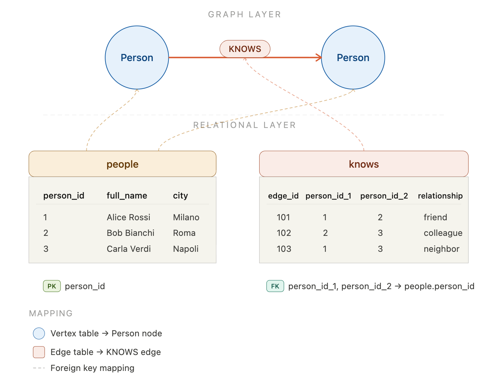
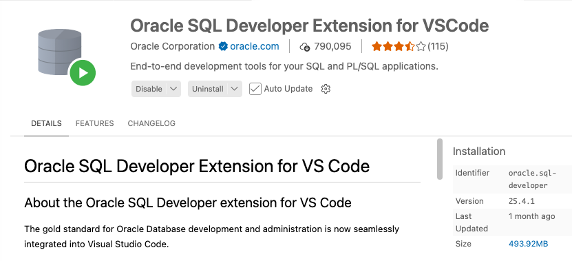
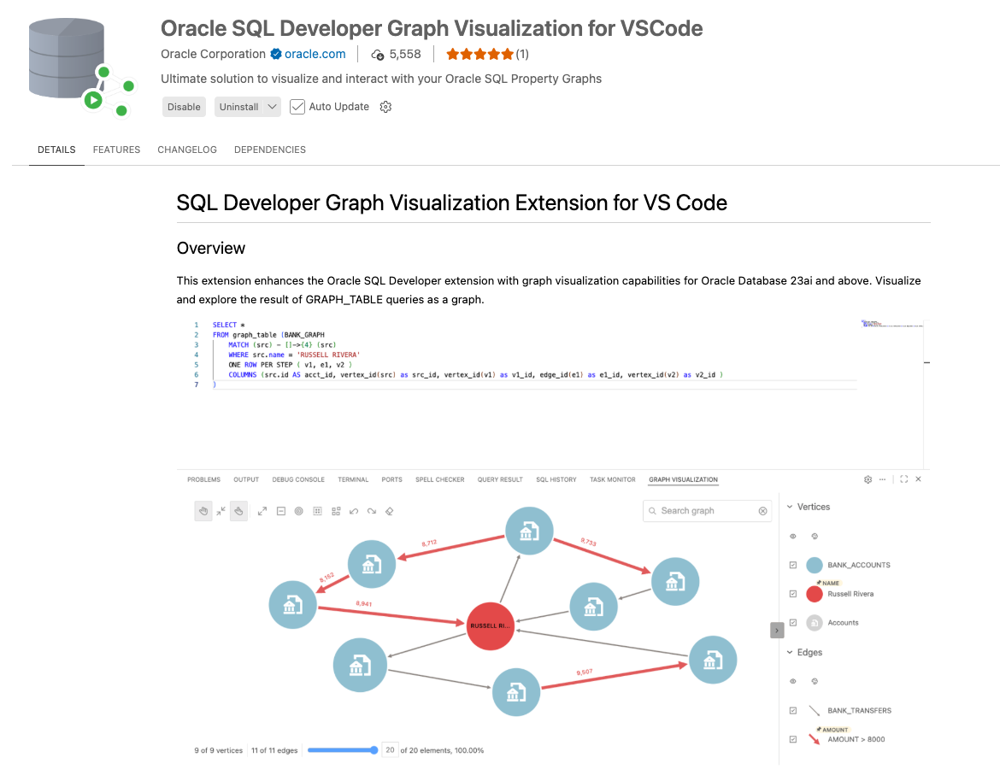
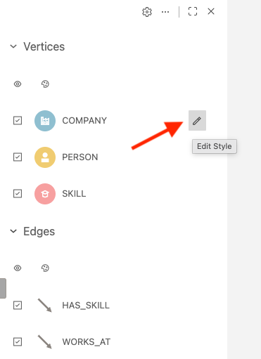
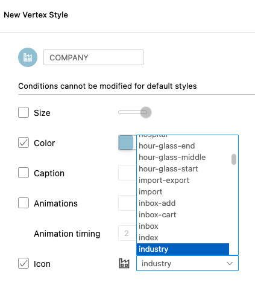
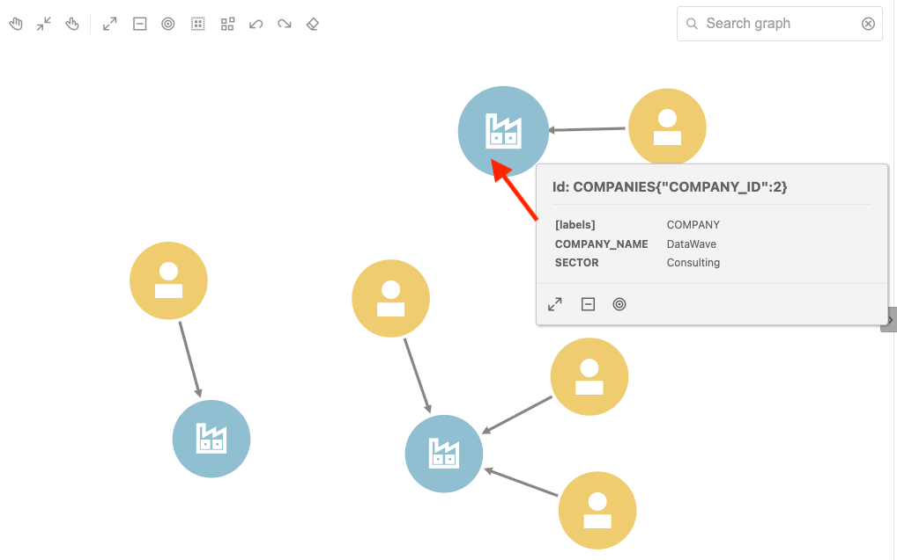
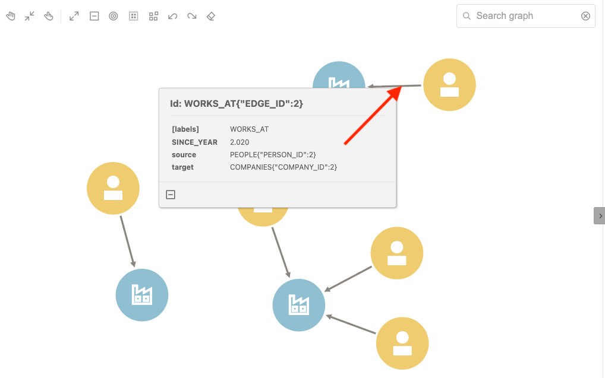
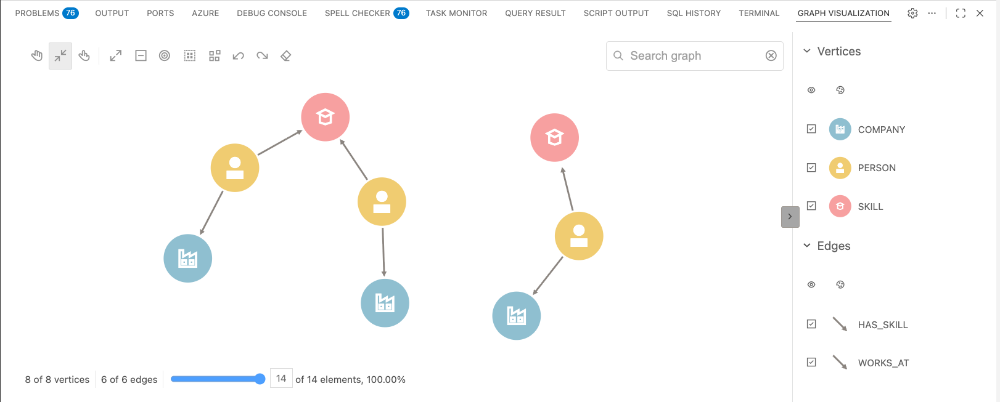

# Oracle SQL Property Graph Tutorial, ep.1: build & query

This tutorial helps you understand the basics of building a Property Graph in Oracle Database. Starting from simple relational tables, you will progressively learn how to define a property graph, query it using SQL/PGQ (Property Graph Queries), and ultimately combine relational tables with graph pattern matching — all within the same SQL statement. The example builds a **professional network** graph in Oracle AI Database 26ai.

<p align="center">
  
</p>

---

## Prerequisites

- **Oracle Database 23ai** (or later) with SQL Property Graph support.
- A database user with `CREATE TABLE` and `CREATE PROPERTY GRAPH` privileges.
- **Oracle SQL Developer Extension for VS Code** — used to connect to the database and run SQL scripts directly from VS Code.

  <p align="center">
    
  </p>

- **Oracle SQL Developer Graph Visualization for VS Code** — used to visualize and interact with your Oracle SQL Property Graphs. Search for "graph visualization" in the VS Code Extensions Marketplace and install the one published by **Oracle Corporation**.

  <p align="center">
    
  </p>

---

## Table of Contents

1. [Cleanup: Drop Existing Objects](#step-1-cleanup-drop-existing-objects)
2. [Create Node Tables](#step-2-create-node-tables)
3. [Create Edge Tables](#step-3-create-edge-tables)
4. [Insert Node Data](#step-4-insert-node-data)
5. [Insert Edge Data](#step-5-insert-edge-data)
6. [Create the Property Graph](#step-6-create-the-property-graph)
7. [Query 1 — Where People Work](#step-7-query-1--where-people-work)
8. [Query 2 — Who Knows Whom](#step-8-query-2--who-knows-whom)
9. [Query 3 — Person, Company and Skill](#step-9-query-3--person-company-and-skill)
10. [Query 4 — Friends of Friends (2-Hop)](#step-10-query-4--friends-of-friends-2-hop)
11. [Create the Project Requests Table](#step-11-create-the-project-requests-table)
12. [Query 5 — Relational-Graph Fusion with CROSS JOIN LATERAL](#step-12-query-5--relational-graph-fusion-with-cross-join-lateral)
13. [Final Graph Visualization](#step-13-final-graph-visualization)
14. [Summary](#summary)

---

## Step 1: Cleanup — Drop Existing Objects

```sql
DROP PROPERTY GRAPH professional_network;

DROP TABLE has_skill;
DROP TABLE knows;
DROP TABLE works_at;
DROP TABLE project_requests;
DROP TABLE skills;
DROP TABLE companies;
DROP TABLE people;
```

Before creating anything, the script drops all objects that may exist from a previous run. The order matters: **edge tables** (which contain foreign keys) are dropped before the **node tables** they reference, and the **property graph** is dropped first because it depends on all of them.

> **Tip:** If this is your first run, these `DROP` statements will raise errors that can be safely ignored.

---

## Step 2: Create Node Tables

Node tables represent the **entities** (vertices) of the graph.

### People

```sql
CREATE TABLE people (
    person_id   NUMBER GENERATED ALWAYS AS IDENTITY PRIMARY KEY,
    full_name   VARCHAR2(100) NOT NULL,
    city        VARCHAR2(50),
    role        VARCHAR2(100)
);
```

Each person has an auto-generated ID, a name, a city, and a professional role.

### Companies

```sql
CREATE TABLE companies (
    company_id   NUMBER GENERATED ALWAYS AS IDENTITY PRIMARY KEY,
    company_name VARCHAR2(100) NOT NULL,
    sector       VARCHAR2(50)
);
```

Each company has an auto-generated ID, a name, and a business sector.

### Skills

```sql
CREATE TABLE skills (
    skill_id   NUMBER GENERATED ALWAYS AS IDENTITY PRIMARY KEY,
    skill_name VARCHAR2(100) NOT NULL,
    category   VARCHAR2(50)
);
```

Each skill has an auto-generated ID, a name, and a category (e.g., *Database*, *Language*, *AI*).

---

## Step 3: Create Edge Tables

Edge tables represent the **relationships** (edges) between nodes.

### WORKS_AT — A person works at a company

```sql
CREATE TABLE works_at (
    edge_id     NUMBER GENERATED ALWAYS AS IDENTITY PRIMARY KEY,
    person_id   NUMBER NOT NULL REFERENCES people(person_id),
    company_id  NUMBER NOT NULL REFERENCES companies(company_id),
    since_year  NUMBER
);
```

Links a `person_id` to a `company_id` with an optional `since_year` property.

### KNOWS — A person knows another person

```sql
CREATE TABLE knows (
    edge_id      NUMBER GENERATED ALWAYS AS IDENTITY PRIMARY KEY,
    person_id_1  NUMBER NOT NULL REFERENCES people(person_id),
    person_id_2  NUMBER NOT NULL REFERENCES people(person_id),
    relationship VARCHAR2(50)  -- 'colleague', 'friend', 'mentor'
);
```

Links two people and stores the type of relationship between them.

### HAS_SKILL — A person has a skill

```sql
CREATE TABLE has_skill (
    edge_id    NUMBER GENERATED ALWAYS AS IDENTITY PRIMARY KEY,
    person_id  NUMBER NOT NULL REFERENCES people(person_id),
    skill_id   NUMBER NOT NULL REFERENCES skills(skill_id),
    job_level  VARCHAR2(20)   -- 'beginner', 'intermediate', 'expert'
);
```

Links a person to a skill with a proficiency level.

---

## Step 4: Insert Node Data

### People (5 professionals)

```sql
INSERT INTO people (full_name, city, role) VALUES ('Marco Rossi',    'Rome',    'Cloud Architect');
INSERT INTO people (full_name, city, role) VALUES ('Laura Bianchi',  'Milan',   'Data Engineer');
INSERT INTO people (full_name, city, role) VALUES ('Paolo Verdi',    'Naples',  'DBA');
INSERT INTO people (full_name, city, role) VALUES ('Sara Neri',      'Turin',   'ML Engineer');
INSERT INTO people (full_name, city, role) VALUES ('Luca Galli',     'Rome',    'DevOps Engineer');
```

### Companies (3 companies)

```sql
INSERT INTO companies (company_name, sector) VALUES ('TechCorp',     'IT');
INSERT INTO companies (company_name, sector) VALUES ('DataWave',     'Consulting');
INSERT INTO companies (company_name, sector) VALUES ('CloudNine',    'Cloud Services');
```

### Skills (4 skills)

```sql
INSERT INTO skills (skill_name, category) VALUES ('Oracle DB',       'Database');
INSERT INTO skills (skill_name, category) VALUES ('Kubernetes',      'Infrastructure');
INSERT INTO skills (skill_name, category) VALUES ('Python',          'Language');
INSERT INTO skills (skill_name, category) VALUES ('Machine Learning','AI');
```

---

## Step 5: Insert Edge Data

### Who works where

```sql
INSERT INTO works_at (person_id, company_id, since_year) VALUES (1, 1, 2019);  -- Marco -> TechCorp
INSERT INTO works_at (person_id, company_id, since_year) VALUES (2, 2, 2020);  -- Laura -> DataWave
INSERT INTO works_at (person_id, company_id, since_year) VALUES (3, 1, 2017);  -- Paolo -> TechCorp
INSERT INTO works_at (person_id, company_id, since_year) VALUES (4, 3, 2021);  -- Sara  -> CloudNine
INSERT INTO works_at (person_id, company_id, since_year) VALUES (5, 1, 2022);  -- Luca  -> TechCorp
```

Three people work at **TechCorp**, one at **DataWave**, and one at **CloudNine**.

### Who knows whom

```sql
INSERT INTO knows (person_id_1, person_id_2, relationship) VALUES (1, 2, 'friend');
INSERT INTO knows (person_id_1, person_id_2, relationship) VALUES (1, 3, 'colleague');
INSERT INTO knows (person_id_1, person_id_2, relationship) VALUES (2, 4, 'colleague');
INSERT INTO knows (person_id_1, person_id_2, relationship) VALUES (3, 5, 'mentor');
INSERT INTO knows (person_id_1, person_id_2, relationship) VALUES (4, 5, 'friend');
```

This creates a small social network: Marco knows Laura (friend) and Paolo (colleague), Laura knows Sara (colleague), Paolo mentors Luca, and Sara knows Luca (friend).

### Who has which skill

```sql
INSERT INTO has_skill (person_id, skill_id, job_level) VALUES (1, 2, 'expert');        -- Marco:  Kubernetes (expert)
INSERT INTO has_skill (person_id, skill_id, job_level) VALUES (1, 1, 'intermediate');  -- Marco:  Oracle DB (intermediate)
INSERT INTO has_skill (person_id, skill_id, job_level) VALUES (2, 3, 'expert');        -- Laura:  Python (expert)
INSERT INTO has_skill (person_id, skill_id, job_level) VALUES (2, 4, 'intermediate');  -- Laura:  Machine Learning (intermediate)
INSERT INTO has_skill (person_id, skill_id, job_level) VALUES (3, 1, 'expert');        -- Paolo:  Oracle DB (expert)
INSERT INTO has_skill (person_id, skill_id, job_level) VALUES (4, 4, 'expert');        -- Sara:   Machine Learning (expert)
INSERT INTO has_skill (person_id, skill_id, job_level) VALUES (4, 3, 'expert');        -- Sara:   Python (expert)
INSERT INTO has_skill (person_id, skill_id, job_level) VALUES (5, 2, 'intermediate');  -- Luca:   Kubernetes (intermediate)

COMMIT;
```

---

## Step 6: Create the Property Graph

This is the core of the tutorial. The `CREATE PROPERTY GRAPH` statement maps existing relational tables onto a graph model.

```sql
CREATE PROPERTY GRAPH professional_network

  VERTEX TABLES (
    people
      KEY (person_id)
      LABEL Person
      PROPERTIES (full_name, city, role),

    companies
      KEY (company_id)
      LABEL Company
      PROPERTIES (company_name, sector),

    skills
      KEY (skill_id)
      LABEL Skill
      PROPERTIES (skill_name, category)
  )

  EDGE TABLES (
    works_at
      KEY (edge_id)
      SOURCE KEY (person_id) REFERENCES people (person_id)
      DESTINATION KEY (company_id) REFERENCES companies (company_id)
      LABEL WORKS_AT
      PROPERTIES (since_year),

    knows
      KEY (edge_id)
      SOURCE KEY (person_id_1) REFERENCES people (person_id)
      DESTINATION KEY (person_id_2) REFERENCES people (person_id)
      LABEL KNOWS
      PROPERTIES (relationship),

    has_skill
      KEY (edge_id)
      SOURCE KEY (person_id) REFERENCES people (person_id)
      DESTINATION KEY (skill_id) REFERENCES skills (skill_id)
      LABEL HAS_SKILL
      PROPERTIES (job_level)
  );
```

### What is happening here

| Clause | Purpose |
|---|---|
| `VERTEX TABLES` | Declares which relational tables become **nodes**. Each gets a `KEY`, a `LABEL`, and a set of `PROPERTIES`. |
| `EDGE TABLES` | Declares which relational tables become **edges**. Each gets a `KEY`, a `SOURCE` (start node), a `DESTINATION` (end node), a `LABEL`, and `PROPERTIES`. |
| `KEY` | The primary key column used to uniquely identify each vertex or edge. |
| `LABEL` | A logical name you use in graph queries to refer to a vertex or edge type. |
| `PROPERTIES` | The columns exposed as properties in graph queries. |

> **Key concept:** The property graph is a **logical view** over your relational tables — no data is duplicated. When you query the graph, Oracle reads directly from the underlying tables.

---

## Step 7: Query 1 — Where People Work

```sql
SELECT *
FROM GRAPH_TABLE (
    professional_network
    MATCH (p IS Person) -[w IS WORKS_AT]-> (c IS Company)
    COLUMNS (
        VERTEX_ID(p)   AS p_id,
        VERTEX_ID(c)   AS c_id,
        EDGE_ID(w)     AS w_id,
        p.full_name    AS person_name,
        c.company_name AS company,
        w.since_year   AS since
    )
)
ORDER BY since;
```

### How to read this

- **`GRAPH_TABLE(...)`** — opens a graph query block.
- **`MATCH (p IS Person) -[w IS WORKS_AT]-> (c IS Company)`** — defines a pattern: find every path where a `Person` node is connected via a `WORKS_AT` edge to a `Company` node. The arrow `->` indicates direction.
- **`COLUMNS (...)`** — projects specific properties into a relational result set. `VERTEX_ID()` and `EDGE_ID()` return the internal graph identifiers.
- The outer `ORDER BY since` sorts results by the year the person joined.

### Expected output

| person_name | company | since |
|---|---|---|
| Paolo Verdi | TechCorp | 2017 |
| Marco Rossi | TechCorp | 2019 |
| Laura Bianchi | DataWave | 2020 |
| Sara Neri | CloudNine | 2021 |
| Luca Galli | TechCorp | 2022 |

### Visualizing the query as a graph

You can visualize the result of any `GRAPH_TABLE` query as an interactive diagram. After you have selected the query in the SQL Developer worksheet, click the **Graph Visualization** icon in the VS Code toolbar:

<p align="center">
  
</p>

This opens the Graph Visualization panel, where vertices and edges from your query are rendered as a navigable diagram.

### Customizing node styles

In the right-hand panel, each vertex label (e.g., COMPANY, PERSON) is listed under **Vertices**. Click the **pencil icon** next to a label to customize its appearance — you can change the color, size, caption, and icon:

<p align="center">
  
</p>

For example, you can assign the **industry** icon to the `COMPANY` nodes to make them visually distinct from people:

<p align="center">
  
</p>

### Navigating the graph

Once the graph is rendered, you can click on any element to inspect its properties.

**Click on a vertex** to see its details. For example, clicking on a Company node reveals its `COMPANY_NAME` and `SECTOR`:

<p align="center">
  
</p>

**Click on an edge** to see the relationship details. For example, clicking on a `WORKS_AT` edge shows the `SINCE_YEAR`, along with the source person and the target company:

<p align="center">
  
</p>

---

## Step 8: Query 2 — Who Knows Whom

```sql
SELECT *
FROM GRAPH_TABLE (
    professional_network
    MATCH (a IS Person) -[k IS KNOWS]-> (b IS Person)
    COLUMNS (
        VERTEX_ID(a)   AS a_id,
        VERTEX_ID(b)   AS b_id,
        EDGE_ID(k)     AS k_id,
        a.full_name    AS person_1,
        b.full_name    AS person_2,
        k.relationship AS relationship_type
    )
)
ORDER BY relationship_type;
```

This traverses all `KNOWS` edges to show every direct connection and its type (colleague, friend, mentor).

### Expected output

| person_1 | person_2 | relationship_type |
|---|---|---|
| Marco Rossi | Paolo Verdi | colleague |
| Laura Bianchi | Sara Neri | colleague |
| Marco Rossi | Laura Bianchi | friend |
| Sara Neri | Luca Galli | friend |
| Paolo Verdi | Luca Galli | mentor |

---

## Step 9: Query 3 — Person, Company and Skill

```sql
SELECT *
FROM GRAPH_TABLE (
    professional_network
    MATCH
        (p IS Person) -[w IS WORKS_AT]->  (c IS Company),
        (p)           -[h IS HAS_SKILL]-> (s IS Skill)
    COLUMNS (
        VERTEX_ID(p)   AS p_id,
        VERTEX_ID(c)   AS c_id,
        VERTEX_ID(s)   AS s_id,
        EDGE_ID(w)     AS w_id,
        EDGE_ID(h)     AS h_id,
        p.full_name    AS person_name,
        p.role         AS job_role,
        c.company_name AS company,
        s.skill_name   AS skill,
        h.job_level    AS skill_level
    )
)
ORDER BY person_name, skill;
```

### What is new here

The `MATCH` clause contains **two patterns separated by a comma**. Both patterns share the same vertex variable `(p)`, which acts as a **join point**. This means: "for each person, find the company they work at AND the skills they have."

This is equivalent to a multi-table join in relational SQL, but expressed as graph pattern matching.

### Expected output

| person_name | job_role | company | skill | skill_level |
|---|---|---|---|---|
| Laura Bianchi | Data Engineer | DataWave | Machine Learning | intermediate |
| Laura Bianchi | Data Engineer | DataWave | Python | expert |
| Luca Galli | DevOps Engineer | TechCorp | Kubernetes | intermediate |
| Marco Rossi | Cloud Architect | TechCorp | Kubernetes | expert |
| Marco Rossi | Cloud Architect | TechCorp | Oracle DB | intermediate |
| Paolo Verdi | DBA | TechCorp | Oracle DB | expert |
| Sara Neri | ML Engineer | CloudNine | Machine Learning | expert |
| Sara Neri | ML Engineer | CloudNine | Python | expert |

---

## Step 10: Query 4 — Friends of Friends (2-Hop)

```sql
SELECT *
FROM GRAPH_TABLE (
    professional_network
    MATCH (a IS Person) -[k1 IS KNOWS]-> (b IS Person) -[k2 IS KNOWS]-> (c IS Person)
    WHERE VERTEX_ID(a) <> VERTEX_ID(c)
    COLUMNS (
        VERTEX_ID(a)   AS a_id,
        VERTEX_ID(b)   AS b_id,
        VERTEX_ID(c)   AS c_id,
        EDGE_ID(k1)    AS k1_id,
        EDGE_ID(k2)    AS k2_id,
        a.full_name    AS person_name,
        b.full_name    AS through,
        c.full_name    AS friend_of_friend
    )
)
ORDER BY person_name;
```

### What is new here

- **2-hop pattern:** The `MATCH` clause chains two edges (`k1` and `k2`) to traverse from person `a` through person `b` to person `c`. This finds **friends of friends**.
- **`WHERE VERTEX_ID(a) <> VERTEX_ID(c)`** ensures the start and end person are different (avoids trivial loops).

This kind of multi-hop traversal is where graph queries truly shine compared to traditional SQL — a 2-hop path requires a self-join with relational SQL, but is expressed naturally in graph pattern syntax.

### Expected output

| person_name | through | friend_of_friend |
|---|---|---|
| Marco Rossi | Laura Bianchi | Sara Neri |
| Marco Rossi | Paolo Verdi | Luca Galli |
| Laura Bianchi | Sara Neri | Luca Galli |
| Paolo Verdi | Luca Galli | *(none — Luca has no outgoing KNOWS)* |

---

## Step 11: Create the Project Requests Table

```sql
CREATE TABLE project_requests (
    request_id     NUMBER GENERATED ALWAYS AS IDENTITY PRIMARY KEY,
    project_name   VARCHAR2(100),
    required_skill VARCHAR2(100),
    min_level      VARCHAR2(20)
);

INSERT INTO project_requests (project_name, required_skill, min_level)
    VALUES ('Cloud Migration', 'Kubernetes', 'expert');
INSERT INTO project_requests (project_name, required_skill, min_level)
    VALUES ('Data Pipeline', 'Python', 'expert');
COMMIT;
```

This is a standard **relational table** — it is *not* part of the property graph. Each row represents a project that requires a specific skill at a minimum proficiency level. It will be used in the next query to demonstrate how relational and graph data can be combined.

---

## Step 12: Query 5 — Relational-Graph Fusion with CROSS JOIN LATERAL

```sql
SELECT
    pr.project_name,
    gt.p_id,
    gt.s_id,
    gt.c_id,
    gt.h_id,
    gt.w_id,
    gt.person_name,
    gt.company,
    gt.skill,
    gt.skill_level
FROM
    project_requests pr
    CROSS JOIN LATERAL (
        SELECT *
        FROM GRAPH_TABLE (
            professional_network
            MATCH
                (p IS Person) -[h IS HAS_SKILL]-> (s IS Skill),
                (p)           -[w IS WORKS_AT]->  (c IS Company)
            COLUMNS (
                VERTEX_ID(p)   AS p_id,
                VERTEX_ID(s)   AS s_id,
                VERTEX_ID(c)   AS c_id,
                EDGE_ID(h)     AS h_id,
                EDGE_ID(w)     AS w_id,
                p.full_name    AS person_name,
                s.skill_name   AS skill,
                h.job_level    AS skill_level,
                c.company_name AS company
            )
        )
        WHERE UPPER(skill) = UPPER(pr.required_skill)
          AND skill_level = pr.min_level
    ) gt
ORDER BY pr.project_name, gt.person_name;
```

### What is new here

This is the most advanced query in the tutorial. It combines **relational data** (`project_requests`) with **graph pattern matching** using `CROSS JOIN LATERAL`.

| Concept | Explanation |
|---|---|
| `CROSS JOIN LATERAL` | For **each row** in `project_requests`, execute the graph query on the right side. The lateral subquery can reference columns from `pr` (the outer table). |
| `WHERE UPPER(skill) = UPPER(pr.required_skill)` | Filters graph results to match the skill required by the current project request. |
| `AND skill_level = pr.min_level` | Further filters to only people who meet the minimum proficiency level. |

This pattern is powerful because it lets you use a standard relational table to **parameterize** a graph traversal — for each project request, the database finds the matching people in the graph.

### Expected output

| project_name | person_name | company | skill | skill_level |
|---|---|---|---|---|
| Cloud Migration | Marco Rossi | TechCorp | Kubernetes | expert |
| Data Pipeline | Laura Bianchi | DataWave | Python | expert |
| Data Pipeline | Sara Neri | CloudNine | Python | expert |

---

## Step 13: Final Graph Visualization

After running all the queries and customizing the node styles as shown in Step 7, you get a clear, interactive visualization of the entire professional network:

<p align="center">
  
</p>

The graph shows all three vertex types (**Person**, **Company**, **Skill**) with distinct icons and colors, connected by labeled edges (**WORKS_AT**, **KNOWS**, **HAS_SKILL**).

---

## Summary

| Step | What you learned |
|---|---|
| Tables | Graph nodes and edges are stored in regular relational tables. |
| `CREATE PROPERTY GRAPH` | Maps existing tables to a graph model with vertices, edges, labels, and properties. |
| `GRAPH_TABLE` + `MATCH` | Query the graph using pattern matching inside standard SQL. |
| Multi-pattern `MATCH` | Comma-separated patterns share variables to express complex joins naturally. |
| Multi-hop traversal | Chain edges in a `MATCH` to traverse paths of any length. |
| `CROSS JOIN LATERAL` | Combine relational tables with graph queries for hybrid relational-graph analytics. |
| Graph Visualization | Use the VS Code extension to visually explore vertices, edges, and their properties. |

The full data model looks like this:

```
[Person] --WORKS_AT--> [Company]
[Person] --KNOWS-----> [Person]
[Person] --HAS_SKILL-> [Skill]
```

You now have a complete, working example of Oracle SQL Property Graphs that you can extend with your own data and queries.

---

## References

- [Oracle Property Graph Developer's Guide](https://docs.oracle.com/en/database/oracle/property-graph/26.1/spgdg/introduction-property-graphs.html) — Official documentation for SQL Property Graphs in Oracle Database.
- [Oracle Database 26ai Free — Container Image](https://container-registry.oracle.com/ords/f?p=113:4:11934700292093:::4:P4_REPOSITORY,AI_REPOSITORY,AI_REPOSITORY_NAME,P4_REPOSITORY_NAME,P4_EULA_ID,P4_BUSINESS_AREA_ID:1863,1863,Oracle%20Database%20Free,Oracle%20Database%20Free,1,0&cs=39ZmZQ18pCTauOIxsPSPo4MHtwZSoU-9Zl_5L3VEMp5yDzgIPE1uAKwur-KezwhrpiiSRpbAdCUBQljwNXu1bEw) — Pull the Oracle Database 26ai Free image to get started quickly with a local environment.

---

## Disclaimer

*The views expressed here are my own and do not necessarily reflect the views of Oracle.*
