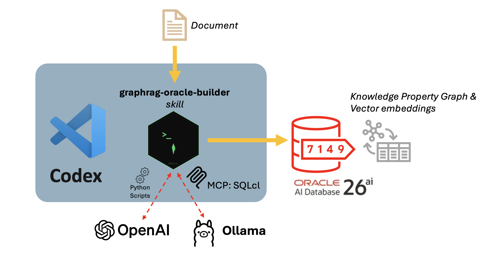

# A Codex Skill for Building Knowledge Graphs for RAG on Oracle AI DB 26ai

<p align="center">
  <a href="https://github.com/corradodebari/skills/tree/main/graphrag-oracle-builder">
    
  </a>
  <a href="https://www.oracle.com/database/">
    
  </a>
  <a href="https://openai.com/codex/">
    
  </a>
</p>

## Purpose
`graphrag-oracle-builder` is a Codex Skill that builds a **GraphRAG knowledge base** from unstructured documents and stores it in **Oracle AI Database 26ai Converged Database**. You'll find [**here**](https://github.com/corradodebari/skills/tree/main/graphrag-oracle-builder).

The skill is designed for knowledge-agent use cases where answers require both:
- semantic retrieval from text chunks (RAG)
- multi-hop reasoning across entities and relationships (Graph)


<p align="center">
  
</p>

## Why Graph + RAG Is Better for Knowledge Agents
A pure vector-RAG approach is strong for semantic similarity, but weaker at explicit relationship traversal. GraphRAG combines both strengths.

#### Key advantages
- Better multi-hop reasoning: answers requiring chains like `person -> project -> incident -> policy` become explicit and queryable.
- Grounded answers with evidence: UUID provenance links extracted facts back to exact chunks.
- Reduced hallucination risk: the agent can verify claims against graph structure plus source chunks.
- Higher recall on scattered facts: graph edges connect information spread across distant document sections.
- Explainability: PGQL traversal paths are auditable and easy to inspect.

#### Why Oracle AI DB 26ai Converged DB Is a Good Fit
Oracle AI Database 26ai Converged Database lets the knowledge agent keep graph, vectors, and operational data in one platform.

- Property Graph + PGQL for relationship-centric retrieval.
- Vector support for semantic search and embedding-based recall.
- Relational/JSON/document support in the same database for enterprise integration.
- Security/governance/backup managed with the same Oracle controls.
- Simpler architecture: fewer moving parts than separate graph + vector + RDBMS stacks.
- Continuous knowledge growth by incrementally ingesting new documents into existing graphs.

#### Typical Knowledge-Agent Pattern on Oracle
1. User asks a question.
2. Agent retrieves top semantic chunks from vector store.
3. Agent expands context via graph neighbors and multi-hop paths.
4. Agent composes answer using both chunk evidence and graph relationships.
5. Agent returns citations/provenance from chunk UUIDs and source docs.

This pattern improves factual consistency and coverage for enterprise knowledge tasks such as incident analysis, compliance tracing, and organizational intelligence.

#### Research Foundation
This skill is aligned with recent GraphRAG and RAG literature. Primary references:

1. Edge, D., et al. (2024). *From Local to Global: A Graph RAG Approach to Query-Focused Summarization*. arXiv:2404.16130. https://arxiv.org/abs/2404.16130
2. Lewis, P., et al. (2020). *Retrieval-Augmented Generation for Knowledge-Intensive NLP Tasks*. arXiv:2005.11401. https://arxiv.org/abs/2005.11401
3. Sarthi, P., et al. (2024). *RAPTOR: Recursive Abstractive Processing for Tree-Organized Retrieval*. arXiv:2401.18059. https://arxiv.org/abs/2401.18059
4. Tang, Y., Yang, Y. (2024). *MultiHop-RAG: Benchmarking Retrieval-Augmented Generation for Multi-Hop Queries*. arXiv:2401.15391. https://arxiv.org/abs/2401.15391
5. Jimenez Gutierrez, B., et al. (2024). *HippoRAG: Neurobiologically Inspired Long-Term Memory for Large Language Models*. arXiv:2405.14831. https://arxiv.org/abs/2405.14831
6. Peng, B., et al. (2024). *Graph Retrieval-Augmented Generation: A Survey*. arXiv:2408.08921. https://arxiv.org/abs/2408.08921

## Skill description

### What This Skill Contains
Main components in this directory:

- `SKILL.md`: operational rules, mandatory preflight, execution policy, and required outputs.
- `scripts/graph_user.py`: optional Oracle user validation/creation phase.
- `scripts/graph_extract.py`: chunking + extraction prompt generation, and optional provider-based extraction.
- `scripts/graph_store.py`: SQL generation for graph schema/data plus embedding generation.
- `scripts/graphrag_builder.py`: full pipeline orchestration helpers used by split scripts.
- `scripts/chunks_to_langchain_oracle_vs.py`: mandatory chunk ingestion into Oracle-backed LangChain vector store at the end of the pipeline.
- `scripts/prompt_text_to_graph.txt`: extraction prompt template.
- `temp/`: generated artifacts (`output_chunks.json`, `codex_prompt_chunks.txt`, `output_schema.json`, `*.sql`).

### Functional Flow
The skill implements a split GraphRAG pipeline:

1. Chunk input documents into semantic fragments.
2. Extract entities and relationships from chunks.
3. Preserve chunk UUID provenance for vertices/edges (traceability/evidence).
4. Generate Oracle SQL for vertex/edge tables + `CREATE PROPERTY GRAPH`.
5. Generate embeddings for vertices and edges (`ollama` or `openai`).
6. Optionally execute SQL in Oracle.
7. Store chunks in an Oracle LangChain vector store table (mandatory pipeline phase).

### Incremental Growth: Add More Documents to an Existing Graph
You can extend a graph that is already created. You do not need to rebuild from zero every time.

- Run extract phase on new documents to produce updated `temp/output_chunks.json` and `temp/output_schema.json`.
- Run store phase with the **same** `--graph-name` used by the existing graph.
- Generate and apply SQL without drop/recreate (`--force-recreate` off) to append new entities/edges.
- Keep UUID provenance to track which new chunks introduced which graph facts.

Example:

```bash
.venv/bin/python scripts/graph_extract.py \
  --llm-provider codex \
  --chunks-output temp/output_chunks.json \
  --merged-prompt-output temp/codex_prompt_chunks.txt \
  --schema-output temp/output_schema.json \
  new_doc1.pdf new_doc2.docx

.venv/bin/python scripts/graph_store.py \
  --schema-input temp/output_schema.json \
  --chunks-input temp/output_chunks.json \
  --graph-name MY_KG \
  --sql-output temp/graphrag_setup_incremental.sql \
  --embed-provider ollama \
  --embed-model nomic-embed-text \
  --embed-dim 768
```

### Core Outputs
Artifacts generated under `temp/`:

- `output_chunks.json`: chunk text + metadata + source references.
- `codex_prompt_chunks.txt`: merged extraction prompt (`prompt template + chunks`).
- `output_schema.json`: extracted graph schema (`vertex`, `edge`, `connection`) with UUID evidence.
- `graphrag_setup.sql`: DDL/DML for Oracle graph build.

Database result:

- Vertex tables (`V_<ENTITY_TYPE>`)
- Edge tables (`E_<REL_TYPE>`)
- Oracle Property Graph definition
- Embedding vectors on graph records

## How To Use
You need the following modules:

- Visual Studio Code
- Oracle SQL Developer Extension for VS Code 
- Oracle AI Database version 23ai or later
- Oracle SQLcl installed and configured as MCP server.
- Codex – OpenAI’s coding agent plugin for VSCode

In Codex, installed in VS Code, use the built in skill to install from github repo:

```
skill-installer from https://github.com/corradodebari/skills/tree/main/graphrag-oracle-builder
```

### Video Demo

<iframe
  width="960"
  height="540"
  src="https://www.youtube.com/embed/OXWeSPMDr_I?autoplay=1&mute=1&playsinline=1"
  title="GraphRAG Oracle Builder Demo"
  frameborder="0"
  allow="accelerometer; autoplay; clipboard-write; encrypted-media; gyroscope; picture-in-picture; web-share"
  referrerpolicy="strict-origin-when-cross-origin"
  allowfullscreen>
</iframe>

### Invoke from Codex
Use prompts such as:

- `Build GraphRAG in Oracle from these files: ...`
- `Create the graph from my docs in graphrag-oracle-builder`
- `Generate setup SQL only for a knowledge graph named MY_KG`

Codex will guide required inputs (LLM provider, execution mode, Oracle user, user existence, input files), then run the following skill pipeline.

### Skill pipeline

#### 1. Prepare environment
From `graphrag-oracle-builder/`:

```bash
python3.11 -m venv .venv
source .venv/bin/activate
python -m pip install -U pip
python -m pip install docling oracledb requests langchain-community
```

#### 2. Extract phase (chunk + schema artifacts)
```bash
.venv/bin/python scripts/graph_extract.py \
  --llm-provider codex \
  --chunks-output temp/output_chunks.json \
  --merged-prompt-output temp/codex_prompt_chunks.txt \
  --schema-output temp/output_schema.json \
  your_doc1.pdf your_doc2.docx
```

In `codex` mode, use `temp/codex_prompt_chunks.txt` with Codex and save the JSON response to `temp/output_schema.json`.

#### 3. Store phase (generate Oracle SQL)
```bash
.venv/bin/python scripts/graph_store.py \
  --schema-input temp/output_schema.json \
  --chunks-input temp/output_chunks.json \
  --graph-name MY_KG \
  --sql-output temp/graphrag_setup.sql \
  --embed-provider ollama \
  --embed-model nomic-embed-text \
  --embed-dim 768
```

To add documents to an existing graph, keep the same `--graph-name` and do not use `--force-recreate`.

#### 4. Execute SQL (only with explicit confirmation)
Prefer SQLcl MCP first:

```text
mcp__sqlcl__connect  connection_name=<graphrag-conn>
mcp__sqlcl__run_sqlcl  sqlcl=@temp/graphrag_setup.sql
```

If SQLcl MCP is unavailable, use direct `oracledb` execution as fallback.

#### 5. Mandatory: persist chunks to Oracle LangChain vector store
```bash
.venv/bin/python scripts/chunks_to_langchain_oracle_vs.py \
  --chunks-input temp/output_chunks.json \
  --db-user graphuser \
  --db-password mypass \
  --db-dsn host:1521/FREEPDB1 \
  --table-name LANGCHAIN_CHUNKS_VS \
  --embed-model nomic-embed-text:latest
```

Use the same embedding model family used in `graph_store.py` for retrieval consistency.

#### 6. Validate with a PGQL query
```sql
SELECT *
FROM GRAPH_TABLE (
  MY_KG
  MATCH (s)-[e]->(t)
  COLUMNS (
    VERTEX_ID(s)  AS src_id,
    s.name        AS src_name,
    EDGE_ID(e)    AS edge_id,
    e.description AS edge_desc,
    VERTEX_ID(t)  AS dst_id,
    t.name        AS dst_name
  )
);
```

---

## Disclaimer
*The views expressed in this paper are my own and do not necessarily reflect the views of Oracle.*
