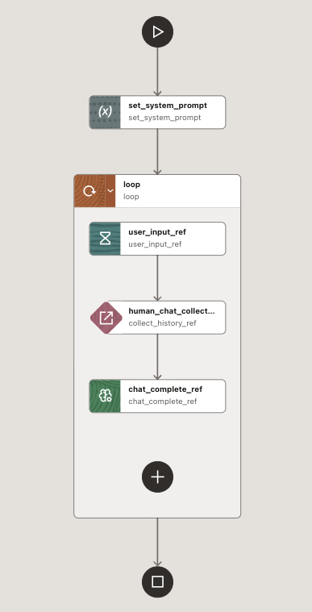
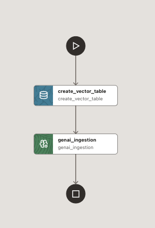
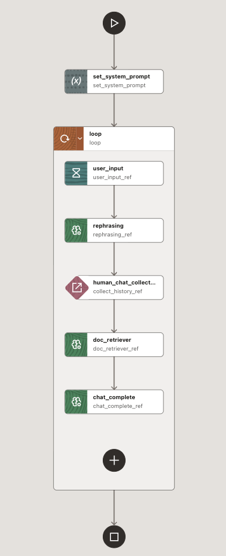

#  MicroTx Workflows: ChatBot/RAG examples

In this tutorial, I'll show an examples of an interactive chatbot with OpenAI in MicroTx Workflows, running a Python client, with an instance runnning in the env installed via the **Oracle Live Lab**: [Design and Deploy Agentic Workflows with Large Language Models and Distributed Transactions
](https://livelabs.oracle.com/ords/r/dbpm/livelabs/run-workshop?p210_wid=4243).

## Setup the connection to the OCI VM

- Connect with a shell to the OCI LiveLab VM:
```shell
ssh -i ssh -i <ssh-public-key.key> opc@<OCI_VM_IP>
sudo su - oracle
kubectl get svc -n istio-system
```

- Check whether the EXTERNAL-IP is **10.107.38.138**. In the next step, update the return value accordingly.

- In a separate shell, on local pc, create a tunnel to execute the python chat client:
```shell
ssh -i <ssh-public-key.key> -L 8080:10.107.38.138:80 opc@<OCI_VM_IP>
```

This will allow to access via local browser to the console at: `http://127.0.0.1:8080/consoleui/`

## Install the workflow

### Simple ChatBot
- Import [`llm_chat_human_in_loop.json`](llm_chat_human_in_loop.json) as new workflow. This is the version: **1**. 

<p align="center">
  
</p>

It doesn't need any extra configuration to run.

### RAG ChatBot

- In **Connectors**/**Storage** import the file `get-started-java-development.pdf` from [here](https://docs.oracle.com/en/database/oracle/oracle-database/26/tdpjd/get-started-java-development.pdf)

- Import the [`RAG_ingest_data.json`](RAG_ingest_data.json), to create a vector table and ingest the knowledge base:

<p align="center">
  
</p>

- Run `RAG_ingest_data` one time to create the vector store will support the RAG based chatbot.

- From **Agentic AI**/**Prompt Template**, create a prompt template `rewrite` getting from [here](rewrite.txt). This will support the GenAI Task to rewrite the question before to be used in similarity search chunks retrieval.

- Finally, import the workflow version **2**, you will find in [`llm_chat_human_in_loop_rag.json`](llm_chat_human_in_loop_rag.json):

<p align="center">
  
</p>

With this step the RAG workflow setup is over.

**NOTICE**:
For a GUI bug, if you want change manually in task definition the `human_chat_collect_history`, the `history` param must be set as **Object/Array** type and put straight in the JSON:
```
  "history": "${collect_history_ref.output.result}",
```
In general, if you have an **Object/Array** type parameter, set the value in the workflow json file.


## Chatbot client
### Setup the env to run the chat client 

- In a shell create the python env:
```
python3.11 -m venv conductor
source conductor/bin/activate
python -m pip install -U "pip<26" setuptools wheel

python3.11 install conductor-python
```

### Run

- To run a simple chatbot on OpenAI, execute:
```
source conductor/bin/activate
export CONDUCTOR_SERVER_URL=http://localhost:8080/workflow-server/api  
python3.11 llm_chat_human_in_loop.py
```
- Execution example:
```
(conductor) cdebari@cdebari-mac conductor-examples % python3.11 llm_chat_human_in_loop.py
(start_workflow_request: 'StartWorkflowRequest') -> 'str'
2026-02-16 20:02:39,816 [18689] conductor.client.automator.task_handler INFO     TaskHandler initialized
2026-02-16 20:02:39,816 [18689] conductor.client.automator.task_handler INFO     Starting worker processes...
task runner process Process-2 started
2026-02-16 20:02:39,819 [18689] conductor.client.automator.task_runner INFO     Conductor Worker[name=human_chat_collect_history, pid=18691, status=active, poll_interval=100ms, thread_count=1, poll_timeout=100ms, lease_extend=false, register_task_def=false]
2026-02-16 20:02:39,819 [18689] conductor.client.automator.task_handler INFO     Started 1 TaskRunner process(es)
2026-02-16 20:02:39,820 [18689] conductor.client.automator.task_handler INFO     Started all processes
Started: 7fca1c9b-4a29-49bd-b0c1-90f2ad6f9005
Interactive science chat (type 'quit' to exit)
==================================================

Workflow details: http://localhost:8080/workflow-server/api/workflow/7fca1c9b-4a29-49bd-b0c1-90f2ad6f9005
You: who is George Washington?
Assistant: George Washington was the first President of the United States, serving from 1789 to 1797. He was a key leader during the American Revolutionary War and is often referred to as the "Father of His Country." Washington played a crucial role in the founding of the United States and helped draft the Constitution. He is known for setting many precedents for the presidency and is remembered for his leadership and dedication to the nation.

You: When did he die?
Assistant: George Washington died on December 14, 1799.

You: quit

Ending conversation.

Full conversation: http://localhost:8080/workflow-server/api/workflow/7fca1c9b-4a29-49bd-b0c1-90f2ad6f9005
Conversation History: [
  {
    "role": "system",
    "message": "You are a helpful assistant that knows about science. Answer questions clearly and concisely. If you don't know something, say so. Stay on topic."
  },
  {
    "role": "user",
    "message": "who is George Washington?"
  },
  {
    "role": "assistant",
    "message": "George Washington was the first President of the United States, serving from 1789 to 1797. He was a key leader during the American Revolutionary War and is often referred to as the \"Father of His Country.\" Washington played a crucial role in the founding of the United States and helped draft the Constitution. He is known for setting many precedents for the presidency and is remembered for his leadership and dedication to the nation."
  },
  {
    "role": "user",
    "message": "When did he die?"
  },
  {
    "role": "assistant",
    "message": "George Washington died on December 14, 1799."
  }
]
2026-02-16 20:03:05,633 [18689] conductor.client.automator.task_handler INFO     Stopped worker processes...
```
As you can see, at `http://localhost:8080/workflow-server/api/workflow/7fca1c9b-4a29-49bd-b0c1-90f2ad6f9005` is available the full execution log.

- To run a RAG chatbot, execute:
```
source conductor/bin/activate
export CONDUCTOR_SERVER_URL=http://localhost:8080/workflow-server/api  
python3.11 llm_chat_human_in_loop_rag.py
```

- Execution example:
```
(conductor) cdebari@cdebari-mac conductor-examples % python3.11 llm_chat_human_in_loop_rag.py
(start_workflow_request: 'StartWorkflowRequest') -> 'str'
2026-02-17 19:49:30,823 [49330] conductor.client.automator.task_handler INFO     TaskHandler initialized
2026-02-17 19:49:30,823 [49330] conductor.client.automator.task_handler INFO     Starting worker processes...
task runner process Process-2 started
2026-02-17 19:49:30,827 [49330] conductor.client.automator.task_handler INFO     Started 1 TaskRunner process(es)
2026-02-17 19:49:30,827 [49330] conductor.client.automator.task_handler INFO     Started all processes
2026-02-17 19:49:30,826 [49330] conductor.client.automator.task_runner INFO     Conductor Worker[name=human_chat_collect_history, pid=49334, status=active, poll_interval=100ms, thread_count=1, poll_timeout=100ms, lease_extend=false, register_task_def=false]
Started: 63685d43-a8ad-41b1-b288-b993f87c9775
Interactive science chat (type 'quit' to exit)
==================================================

Workflow details: http://localhost:8080/workflow-server/api/workflow/63685d43-a8ad-41b1-b288-b993f87c9775
You: which database can be used?
Assistant: Oracle Database can be used.

You: which version?
Assistant: You can use Oracle Autonomous Database or Oracle Database Free.

You: any kind of IDE could be used?
Assistant: You can use an integrated development environment (IDE) to develop your application, and this guide specifically uses IntelliJ IDEA community version. Other IDEs may also work, but the documentation focuses on IntelliJ.

You: quit

Ending conversation.

Full conversation log: http://localhost:8080/workflow-server/api/workflow/63685d43-a8ad-41b1-b288-b993f87c9775
Conversation History: [
  {
    "role": "system",
    "message": "You are a helpful assistant that knows about documentation provided. Answer questions clearly and concisely. If you don't know something, say so. Stay on topic."
  },
  {
    "role": "user",
    "message": {
      "response": "Which type of database can be used?"
    }
  },
  {
    "role": "assistant",
    "message": "Oracle Database can be used."
  },
  {
    "role": "user",
    "message": {
      "response": "Which version of the database can be used?"
    }
  },
  {
    "role": "assistant",
    "message": "You can use Oracle Autonomous Database or Oracle Database Free."
  },
  {
    "role": "user",
    "message": {
      "response": "Can any type of IDE be used?"
    }
  }
]
2026-02-17 19:50:27,897 [49330] conductor.client.automator.task_handler INFO     Stopped worker processes...
```
As you can see, the rephrasing make the question more meaningful since re-written according conversation history.


## Disclaimer
*The views expressed in this paper are my own and do not necessarily reflect the views of Oracle.*
