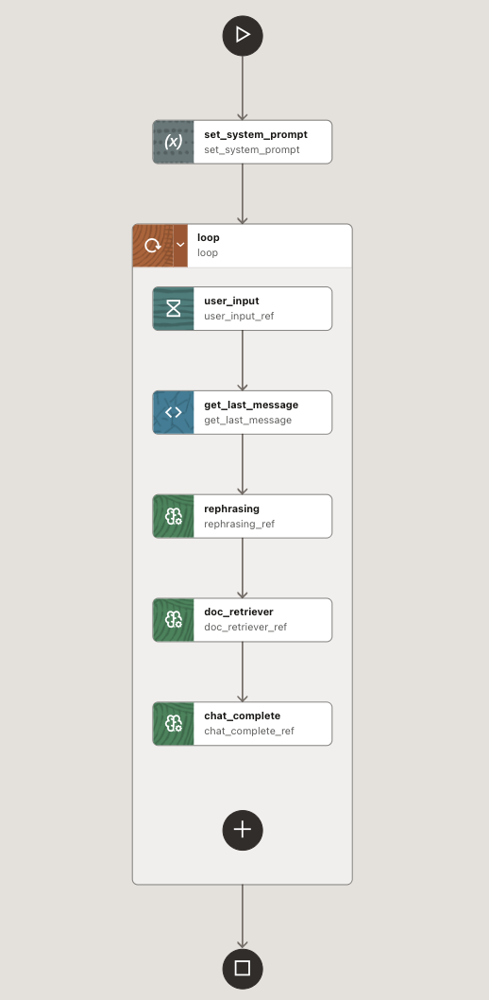
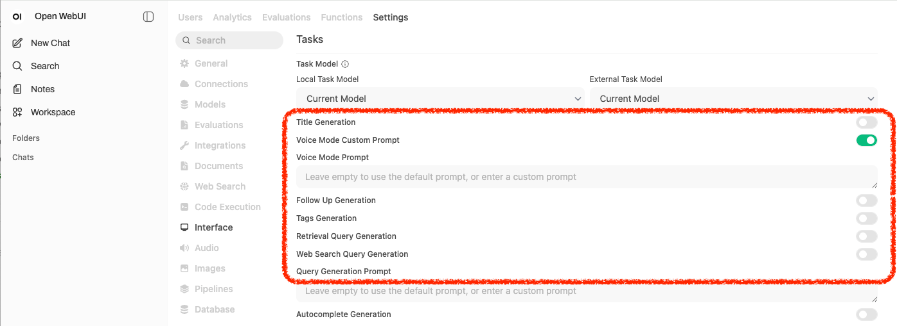
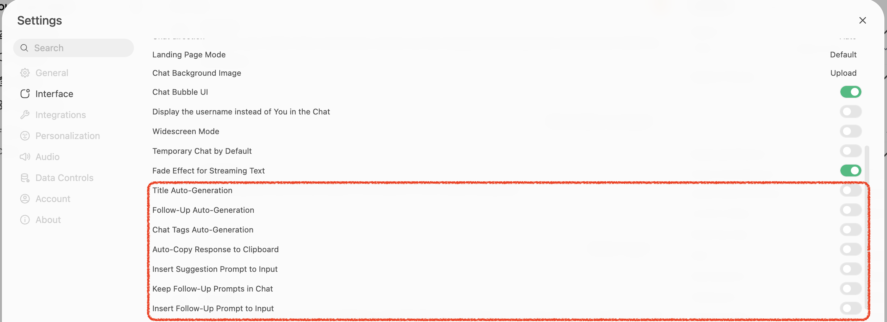
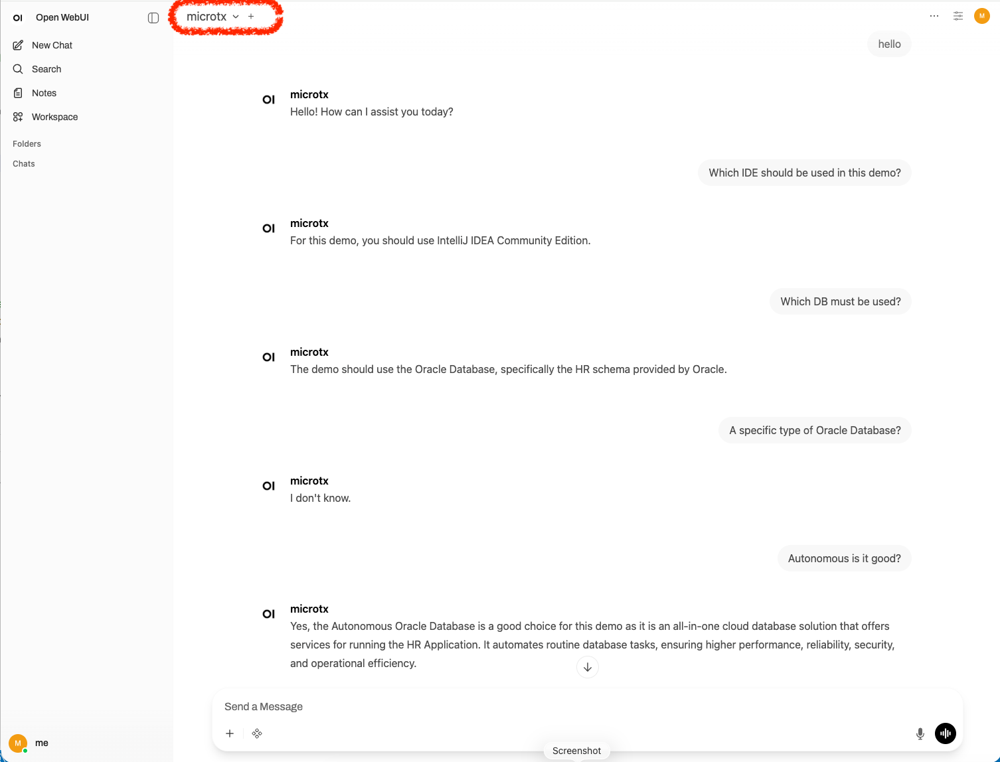

# OpenAI-Compatible Chat Gateway for MicroTx Workflow

This demo exposes an interactive chatbot running as a process on **MicroTx Workflow** as an **OpenAI-compatible API** endpoint, allowing any OpenAI client — including [Open WebUI](https://github.com/open-webui/open-webui) used and tested in this tutorial, to chat with a RAG-powered workflow.

The Python server [llm_chat_human_in_loop_rag_openai.py](./llm_chat_human_in_loop_rag_openai.py) acts as a bridge: it receives standard `/v1/chat/completions` requests, forwards messages to a running MicroTx Workflow workflow via a WAIT task, polls for the LLM response, and returns it in OpenAI format (streaming and non-streaming).

## Architecture

```
┌─────────────┐     OpenAI API      ┌──────────────┐     Conductor API    ┌────────────────────┐
│  Open WebUI │ ──────────────────► │  Python GW   │ ───────────────────► │  MicroTx           │
│  or any     │  /v1/chat/          │  (FastAPI)   │  WAIT task +         │  Workflow          │
│  OpenAI     │  completions        │  port 8000   │  poll OUTPUT         │  (RAG + LLM)       │
│  client     │ ◄────────────────── │              │ ◄─────────────────── │                    │
└─────────────┘   response/stream   └──────────────┘   task result        └────────────────────┘
```

**Flow per request:**
1. Client sends a chat message to `POST /v1/chat/completions`
2. Gateway authenticates via Bearer token (mapped to a single workflow session)
3. Gateway starts a new workflow or reuses an existing running one: the workflow is tied to the KEY_WORKFLOWS.
4. Waits for the workflow to reach the WAIT configured task (`user_input_ref` in this case)
5. Completes the WAIT task with the user's messages
6. Polls until the output configured task (`chat_complete_ref`) produces a fresh result
7. Returns the answer as an OpenAI-compatible response

The example can be configured as-is to expose a different chatbot workflow, simply setting the two entry points defined for the bridge:
- the WAIT task
- the GENAI_TASK or AGENTIC_TASK that will provides the final response to the user. 

## Prerequisites

- **MicroTx server** with AI/LLM support enabled
- **Workflow** `llm_chat_openai_api` (v2) imported into MicroTx Workflow (see **Workflow Setup** below)
- **Python 3.11+**
- **Oracle LiveLab VM** (optional — for the pre-configured environment)

## Installation

```bash
python3.11 -m venv conductor
source conductor/bin/activate
pip install -U "pip<26" setuptools wheel
pip install conductor-python fastapi uvicorn
```

## Configuration

Configuration is loaded from `config.json` (defaults), with **environment variables** taking precedence.

### Environment variables

| Variable | Description | Default |
|---|---|---|
| `MICROTX_WORKFLOW_SERVER_URL` | MicroTx/Conductor API endpoint | *(required)* |
| `LLM_MODEL` | Model name reported to OpenAI clients | `microtx` |
| `WORKFLOW_NAME` | MicroTx Workflow workflow name to start | `llm_chat_openai_api` |
| `WORKFLOW_VERSION` | Workflow version | `2` |
| `INPUT_TASK` | WAIT task reference name in the workflow | `user_input_ref` |
| `OUTPUT_TASK` | Output task reference name to poll for results | `chat_complete_ref` |
| `KEYS_WORKFLOWS` | API keys to workflow ID mapping (JSON string) | from config.json |
| `IDLE_TIMEOUT` | Seconds of inactivity before terminating a workflow | `300` |

### config.json example

```json
{
  "LLM_MODEL": "microtx",
  "WORKFLOW_NAME": "llm_chat_openai_api",
  "WORKFLOW_VERSION": 2,
  "INPUT_TASK": "user_input_ref",
  "OUTPUT_TASK": "chat_complete_ref",
  "IDLE_TIMEOUT": 300,
  "KEYS_WORKFLOWS": {
    "ABC12345": "",
    "ABC67890": ""
  }
}
```

### API keys

The `KEYS_WORKFLOWS` dictionary maps Bearer tokens to workflow sessions. Each key represents an allowed API key; the value is the running workflow ID (initially empty, populated at first request in the bridge).

### Idle timeout

A background task checks every 60 seconds for idle workflows. If a specific API key has had no requests for `IDLE_TIMEOUT` seconds (default: 300 = 5 minutes), only that key's workflow gets terminated. Other keys' workflows remain active. A fresh workflow will be started automatically on the next request for that key.

To override via env:
```bash
export KEYS_WORKFLOWS='{"my-secret-key-1": "", "my-secret-key-2": ""}'
```
## Workflow Setup

Import the workflow definition [`llm_chat_openai_api.json`](llm_chat_openai_api.json) into your MicroTx Workflow instance.

The workflow is done as shown in this picture:

<p align="center">
  
</p>

1. **set_system_prompt** — sets the system prompt as a workflow variable
2. **DO_WHILE loop** (conversation max 50 Q&A):
   - **user_input** (`user_input_ref`) — WAIT task that pauses for user input
   - **get_last_message** — extracts the last user message from the conversation
   - **rephrasing** (`rephrasing_ref`) — rewrites the question using conversation context
   - **doc_retriever** (`doc_retriever_ref`) — retrieves relevant chunks from the vector store
   - **chat_complete** (`chat_complete_ref`) — generates the final answer using retrieved context

For detailed instructions on setting up the RAG pipeline (vector store, prompt templates, document ingestion), see the [interactive chatbot guide](https://corradodebari.github.io/llm_chat_human_in_loop.html).


## Running

Get the MicroTx Workflow server URL and set the related env variable:

```bash
source conductor/bin/activate
export MICROTX_WORKFLOW_SERVER_URL=http://localhost:8080/workflow-server/api
python3.11 llm_chat_human_in_loop_rag_openai.py
```

The server starts on **port 8000** and exposes:
- `GET /v1/models` — lists available models, needed for Open WebUI
- `POST /v1/chat/completions` — chat endpoint (streaming and non-streaming)

## Connecting Open WebUI

Start Open WebUI:
```bash
open-webui serve
```

Then:

1. In Open WebUI, go to **Admin Panel > Connections**
2. Add a new OpenAI-compatible connection:
   - **URL**: `http://localhost:8000/v1`
   - **API Key**: one of the keys from `KEYS_WORKFLOWS` (e.g. `ABC12345`)
3. The model `microtx` (or your configured `LLM_MODEL`) should appear in the model list

### Disable auto-generation features

Open WebUI sends automatic requests (title generation, follow-up suggestions) to your endpoint, which interfere with the MicroTx Workflow. Disable them in:

**Admin Settings > Interface** (admin-level):

<p align="center">
  
</p>

Turn off: **Title Generation**, **Follow Up Generation**, **Tags Generation**, **Retrieval Query Generation**, **Web Search Query Generation**.

**User Settings > Interface** (per-user):

<p align="center">
  
</p>

Turn off: **Title Auto-Generation**, **Follow-Up Auto-Generation**, **Chat Tags Auto-Generation**.

Finally, start a conversation - this is an example in Open WebUI:

<p align="center">
  
</p>

## Disclaimer

*The views expressed here are my own and do not necessarily reflect the views of Oracle.*
