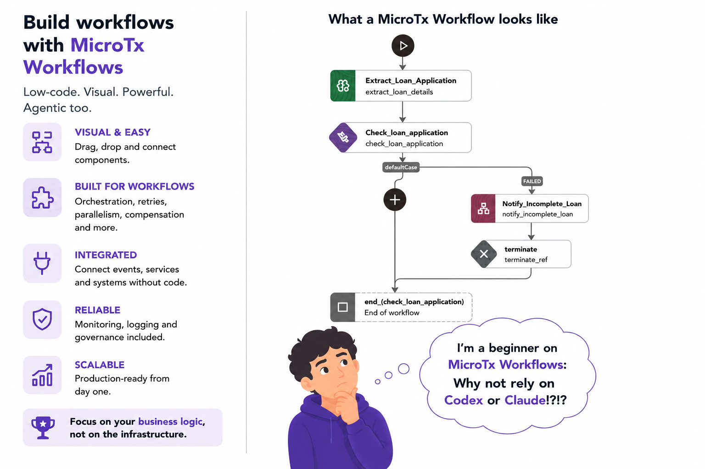

# Vibe Coding in Oracle MicroTx Workflows with a Codex/Claude Skill

<p align="center">
  <a href="https://github.com/corradodebari/skills">
    
  </a>
  <a href="https://www.oracle.com/it/database/transaction-manager-for-microservices/">
    
  </a>
  <a href="https://corradodebari.github.io">
    
  </a>
</p>

<p align="center">
  
</p>

# Summary

I created a specific **MicroTx Workflows skill** for both **Codex** and **Claude** to make workflow development as simple as possible for beginners. Draft your workflows in natural language by providing a specification, then refine them step by step while deploying and debugging. Continue your work visually in the standard web console.
It helps define, run, inspect, and manage Oracle MicroTx workflows, connectors, agent profiles, and human task approvals through REST APIs.
A small step toward making agent-assisted workflow orchestration more practical.


**Download**: **[here](https://github.com/corradodebari/skills)**

**NOTICE**: *The skill has been tested on a local laptop MicroTx installation and is intended for learning and testing only.*

## About MicroTx Workflows

🔔**Oracle MicroTx 26.1** is generally available, uniting durable workflow orchestration (built on the open-source Conductor project) for both agentic and non-agentic workflows, with distributed transaction coordination for microservices (XA, Saga, TCC) in a single platform: on-premises, OCI, and multicloud.

🎯 The result: developers can build resilient enterprise applications that span databases, microservices, AI agents, SaaS, events, and Blockchain/DLT networks — while preserving transactional consistency where it matters most.

⚙️ Try the Free & Enterprise editions: [here](https://www.oracle.com/database/technologies/transaction-manager-for-microservices-downloads.html#) 

🚀 Blog post: [here](https://blogs.oracle.com/database/oracle-microtx-26-1-is-now-generally-available)

## Video Demo

This is an example of using the skill in both tools: Codex and Claude.

<iframe
  width="960"
  height="540"
  src="https://www.youtube.com/embed/hiEXRdvUfrs?autoplay=1&mute=1&playsinline=1"
  title="MicroTx Workflows Skill Demo"
  frameborder="0"
  allow="accelerometer; autoplay; clipboard-write; encrypted-media; gyroscope; picture-in-picture; web-share"
  referrerpolicy="strict-origin-when-cross-origin"
  allowfullscreen>
</iframe>

## Conversation example

### MicroTx Workflows definition & testing

Send the following prompt to Codex/Claude:

```text
# Create a MicroTx workflow.
# Use the LLM connector set called "oci_llm_profiles" for any GENAI_TASK.
# Run on the local CONDUCTOR_SERVER_URL=http://127.0.0.1/workflow-server/api 

Perform the following tasks in order:

# 1. Connect to the local instance of Conductor.

# 2. Create a new workflow named "vibe_loan" with these steps:

  - INPUT: a loan request in natural language.

  - GENAI_TASK (extraction). Using LLM model google.gemini-2.5-pro, extract these fields:
      name   (string)
      age    (integer)
      amount (number)
      duration (number)
      scope  (string)

  - VALIDATION: if any of name, age, amount, duration, scope is missing or null,
    abort the workflow with:
        { approve: false, reason: "minimum info not provided", missing_fields: [<list of missing field names>] }
    and stop.

  - DECISION RULES (evaluate in this exact order; first match wins):
      Rule 1: if age > 50 AND amount > 100000
              -> { approve: false, reason: "age over 50 and amount over 100000 not allowed" }
      Rule 2: else if scope == "home purchase" AND amount >= 50000
              -> { approve: true,  reason: "home purchase, amount >= 50000" }
      Rule 3: else if scope != "home purchase" AND amount < 50000
              -> { approve: true,  reason: "non-home purchase, amount < 50000" }
      Rule 4: else
              -> { approve: false, reason: "<describe which condition was violated>" }

# 3. Deploy the workflow.

# 4. Test A — expect approve = true:
    "I need to purchase a house. I need 60000 euro. I'm 45 years old and
     I need a mortgage for 20 years. My name is Corrado De Bari. Thanks."
    (home purchase, amount 60000 >= 50000, age 45 -> Rule 2 -> true)
    Verify the workflow returns approve = true.

# 5. Test B — expect approve = false:
    "I need to purchase a boat. I need 120000 euro. I'm 60 years old and
     I need a mortgage for 20 years. My name is Corrado De Bari. Thanks."
    (age 60 > 50 and amount 120000 > 100000 -> Rule 1 -> false)
    Verify the workflow returns approve = false.
```
### Query resources/workflows

- Question: `In the local MicroTx instance, give me the list of defined LLM providers`
- Answer:
```
• Local MicroTx has 2 LLM profiles defined:

   Profile             Provider    Region            Models
  ━━━━━━━━━━━━━━━━━━  ━━━━━━━━━━  ━━━━━━━━━━━━━━━━  ━━━━━━━━━━━━━━━━━━━━━━━━━━━━━━━━━━━━━━━━━━━━━━━━━━━━━━━━━
   llm-oci             OCI         eu-frankfurt-1    cohere.command-plus-latest, xai.grok-3, xai.grok-4,
                                                     meta.llama-3.1-405b-instruct, meta.llama-3.3-70b-
                                                     instruct, openai.gpt-4o, openai.gpt-4o-mini,
                                                     openai.gpt-4.1, openai.gpt-5
  ──────────────────  ──────────  ────────────────  ─────────────────────────────────────────────────────────
   oci_llm_profiles    OCI         eu-frankfurt-1    google.gemini-2.5-pro

  So the only provider type currently configured is OCI, with two separate LLM profiles.
```

- Question: `Which DBs are configured?`
- Answer:
```
There is one DB configured:

  oracle-database

  - Engine: ORACLE
  - Username: microtx
  - Capabilities: RELATIONAL, VECTOR, EMBEDDING_GENERATION
  - URL: jdbc:oracle:thin:@tcps://adb.us-ashburn-1.oraclecloud.com:1522/xyz_tpurgent.adb.oraclecloud.com
  - Max pool size: 15

  Password and wallet are masked by MicroTx.
```

- Question: `Have any vibe_loan processes been executed? Give me the list and the related input/output for each process.`
- Answer:
```
Yes. There is one executed vibe_loan_claude process.

   Workflow ID                  Version    Status       Start                       End
  ━━━━━━━━━━━━━━━━━━━━━━━━━━━  ━━━━━━━━━  ━━━━━━━━━━━  ━━━━━━━━━━━━━━━━━━━━━━━━━━  ━━━━━━━━━━━━━━━━━━━━━━━━━━
   133a6347-a009-425f-aa58-           1    COMPLETED    2026-06-16T10:49:27.341Z    2026-06-16T10:50:23.847Z
   fdad91e2b32b

  Input:

  {
    "loan_request": "I need to purchase a house. I need 60000 euro. I'm 45 years old and I need a mortgage
    for 20 years. My name is Corrado De Bari. Thanks.",
    "variables": {}
  }

  Output:

  {
    "reason": "home purchase, amount >= 50000",
    "approve": true,
    "extracted": {
      "name": "Corrado De Bari",
      "age": 45,
      "amount": 60000,
      "duration": 20,
      "scope": "home purchase"
    },
    "human_review": {},
    "idempotencyKey": "microtx.idempotentKey.4333d4ac-7762-411d-bf53-84fd7f28d034"
  }
```

## Disclaimer

*The views expressed here are my own and do not necessarily reflect the views of Oracle.*
