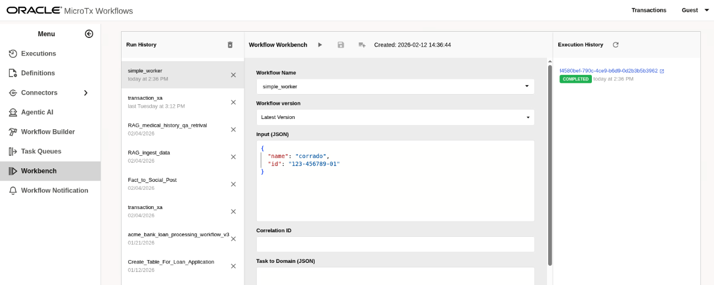

# MicroTx Workflows: simple custom workers

In this tutorial, I'll show how to adapt the basic Python worker example [Python SDK](https://orkes.io/content/sdks/python) to the MicroTx Workflow platform, runnning in the env installed via the **Oracle Live Lab**: [Design and Deploy Agentic Workflows with Large Language Models and Distributed Transactions
](https://livelabs.oracle.com/ords/r/dbpm/livelabs/run-workshop?p210_wid=4243).

It's include a second example to integrate an external DB resource, like sqlite in this case, but you can adapt to other DBs than Oracle DB or Postgres currently supported.

**-->** Next MicroTx Workflow episode**: [MicroTx Workflows Chatbot/RAG](https://corradodebari.github.io/llm_chat_human_in_loop.html)

## Setup the connection to the OCI VM

- Connect with a shell to the OCI LiveLab VM:
```shell
ssh -i ssh -i <ssh-public-key.key> opc@<OCI_VM_IP>
sudo su - oracle
kubectl get svc -n istio-system
```

- Check whether the EXTERNAL-IP is **10.107.38.138**. In the next step, update the return value accordingly.

- In a separate shell, on local pc, create a tunnel to execute the python chat client:
```shell
ssh -i <ssh-public-key.key> -L 8080:10.107.38.138:80 opc@<OCI_VM_IP>
```

This will allow to access via local browser to the console at: `http://127.0.0.1:8080/consoleui/`

## Setup the environment
- Prepare the env:

```shell

python3.11 -m venv conductor
source conductor/bin/activate
python -m pip install -U "pip<26" setuptools wheel

python3.11 install conductor-python
```

- set the standard end-point for engine communication, slightly different by standard Conductor URL:
  
```shell
CONDUCTOR_SERVER_URL=http://127.0.0.1:8080/workflow-server/api  
```
## Install the example workflow

Prepare and create a new workflow based on the `simple_worker.json` with:
```json

{
  "name": "simple_worker",
  "description": "Sample workflow calling simple workers",
  "version": 1,
  "tasks": [
    {
      "name": "get_name",
      "taskReferenceName": "get_name_ref",
      "inputParameters": {
        "name": "${workflow.input.name}"
      },
      "type": "SIMPLE",
      "decisionCases": {},
      "defaultCase": [],
      "forkTasks": [],
      "startDelay": 0,
      "joinOn": [],
      "optional": false,
      "defaultExclusiveJoinTask": [],
      "asyncComplete": false,
      "loopOver": [],
      "onStateChange": {},
      "permissive": false
    },
    {
      "name": "get_id",
      "taskReferenceName": "get_id_ref",
      "inputParameters": {
        "id": "${workflow.input.name}"
      },
      "type": "SIMPLE",
      "decisionCases": {},
      "defaultCase": [],
      "forkTasks": [],
      "startDelay": 0,
      "joinOn": [],
      "optional": false,
      "defaultExclusiveJoinTask": [],
      "asyncComplete": false,
      "loopOver": [],
      "onStateChange": {},
      "permissive": false
    }
  ],
  "inputParameters": [],
  "outputParameters": {},
  "schemaVersion": 2,
  "restartable": true,
  "workflowStatusListenerEnabled": false,
  "timeoutPolicy": "TIME_OUT_WF",
  "timeoutSeconds": 60,
  "variables": {},
  "inputTemplate": {},
  "enforceSchema": true,
  "metadata": {}
}
```

## Develop the workers:

- The actual workers `workers_collection.py`, **get_name** and **get_id**:
```python
from conductor.client.worker.worker_task import worker_task


@worker_task(task_definition_name='get_name')
def get_name(name: str) -> str:
    return f'Hello {name}'

@worker_task(task_definition_name='get_id')
def get_id(id: str) -> str:
    return f'id: {id}'

```

- The workers wrapper `helloworld.py`:

```python
from conductor.client.automator.task_handler import TaskHandler
from conductor.client.configuration.configuration import Configuration
from conductor.client.workflow.executor.workflow_executor import WorkflowExecutor

# Import the simple workers defined
from  workers_collection import get_name,get_id


def main():
    # The workers are connected to this endpoint for MicroTx Workflows:  http://<localhost>/workflow-server/api
    api_config = Configuration()

    workflow_executor = WorkflowExecutor(configuration=api_config)

    # Starting the polling
    task_handler = TaskHandler(configuration=api_config)
    task_handler.start_processes()


if __name__ == '__main__':
    main()
```

### Execution
- To start the worker:
```sh
export CONDUCTOR_SERVER_URL=http://127.0.0.1:8080/workflow-server/api  
python helloworld.py
```
You should see, if it works:

```sh
[oracle@microtx-workflowengine:~/custom_client]$ python helloworld.py 
2026-02-12 14:35:26,548 [2409475] conductor.client.automator.task_handler INFO     TaskHandler initialized
2026-02-12 14:35:26,548 [2409475] conductor.client.automator.task_handler INFO     Starting worker processes...
task runner process Process-2 started
2026-02-12 14:35:26,551 [2409475] conductor.client.automator.task_runner INFO     Conductor Worker[name=get_name, pid=2409477, status=active, poll_interval=100ms, thread_count=1, poll_timeout=100ms, lease_extend=false, register_task_def=false]
task runner process Process-3 started
2026-02-12 14:35:26,555 [2409475] conductor.client.automator.task_handler INFO     Started 2 TaskRunner process(es)
2026-02-12 14:35:26,556 [2409475] conductor.client.automator.task_runner INFO     Conductor Worker[name=get_id, pid=2409478, status=active, poll_interval=100ms, thread_count=1, poll_timeout=100ms, lease_extend=false, register_task_def=false]
2026-02-12 14:35:26,556 [2409475] conductor.client.automator.task_handler INFO     Started all processes
```

- To start the workflow, go in **Workbench**, look for **Workflow name**: `simple_worker`

<p align="center">
  
</p>

set the input, and start.

- to show the trace:
<p align="center">
  
</p>


## SQL adatper example
Let's do a more interesting worker able to integrate a DB resource not Oracle or Postgres.

Prepare and create a new workflow based on the `simple_worker_2.json` with:

```json
{
  "name": "simple_worker",
  "description": "Sample workflow calling simple workers",
  "version": 2,
  "tasks": [
    {
      "name": "query_sqlite",
      "taskReferenceName": "query_sqlite_ref",
      "inputParameters": {
        "connection_string": "fake_people.db",
        "query": "Select * from people"
      },
      "type": "SIMPLE",
      "decisionCases": {},
      "defaultCase": [],
      "forkTasks": [],
      "startDelay": 0,
      "joinOn": [],
      "optional": false,
      "defaultExclusiveJoinTask": [],
      "asyncComplete": false,
      "loopOver": [],
      "onStateChange": {},
      "permissive": false
    }
  ],
  "inputParameters": [],
  "outputParameters": {},
  "schemaVersion": 2,
  "restartable": true,
  "workflowStatusListenerEnabled": false,
  "timeoutPolicy": "TIME_OUT_WF",
  "timeoutSeconds": 60,
  "variables": {},
  "inputTemplate": {},
  "enforceSchema": true,
  "metadata": {}
}
```

### Develop the worker:

- The actual workers `sqlite_query.py`,  has:
  - **execute_sqlite_query()** function with two parameters **connection_string** and **query**
  - **create_fake_database()** function just to create an example db:

```python
import sqlite3
import json
import os
from conductor.client.worker.worker_task import worker_task

# Create database and insert fake data
def create_fake_database():
    if os.path.exists('fake_people.db'):
        return  # Database already exists, skip creation

    conn = sqlite3.connect('fake_people.db')
    cursor = conn.cursor()

    # Create table
    cursor.execute('''CREATE TABLE IF NOT EXISTS people (
        name TEXT,
        surname TEXT,
        birth_date TEXT,
        zip_code TEXT
    )''')

    # Insert fake data
    fake_data = [
        ('John', 'Doe', '1990-01-01', '12345'),
        ('Jane', 'Smith', '1985-05-15', '67890'),
        ('Bob', 'Johnson', '1992-03-20', '11111'),
        ('Alice', 'Williams', '1988-12-10', '22222'),
        ('Charlie', 'Brown', '1995-07-04', '33333')
    ]

    cursor.executemany('INSERT INTO people VALUES (?, ?, ?, ?)', fake_data)
    conn.commit()
    conn.close()

@worker_task(task_definition_name='query_sqlite')
def execute_sqlite_query(connection_string:str, query:str):
    """
    Executes a SQLite SELECT query on the specified database and returns the results as JSON.

    Args:
        connection_string (str): The SQLite database file path or connection string.
        query (str): The SQL SELECT query to execute.

    Returns:
        str: JSON string containing the query results.
    """
    try:
        db_path = os.path.join(os.getcwd(), connection_string)
        conn = sqlite3.connect(db_path)
        cursor = conn.cursor()

        cursor.execute(query)
        results = cursor.fetchall()

        columns = [desc[0] for desc in cursor.description]

        data = [dict(zip(columns, row)) for row in results]

        conn.close()

        return json.dumps(data)
    except Exception as e:
        return json.dumps({"error": str(e)})
```

- The workers wrapper `sqlite_tool.py`, create at startup the db, and expose the worker:

```python
from conductor.client.automator.task_handler import TaskHandler
from conductor.client.configuration.configuration import Configuration
from conductor.client.workflow.executor.workflow_executor import WorkflowExecutor

from sqlite_query import create_fake_database,execute_sqlite_query


def main():
    # The workers are connected to this endpoint for MicroTx Workflows:  http://<localhost>/workflow-server/api
    api_config = Configuration()

    workflow_executor = WorkflowExecutor(configuration=api_config)

    # Starting the polling
    task_handler = TaskHandler(configuration=api_config)
    task_handler.start_processes()


if __name__ == '__main__':
    create_fake_database()
    main()
```

### Execution
- To start the worker, as usual:
```sh
export CONDUCTOR_SERVER_URL=http://127.0.0.1:8080/workflow-server/api  
python sqlite_tool.py.py
```
You should see, if it works:
- to show the trace:
<p align="center">
  
</p>


### Collaterals
- If you want to check if any tasks are in the queue:

```sh
curl -X GET http://127.0.0.1:8080/workflow-server/api/tasks/poll/batch/get_name
```
- If you want take a look to the list of REST API:
```sh
http://10.107.38.138/workflow-server/swagger-ui/index.html#/metadata-resource/getAll
```


## Disclaimer
*The views expressed in this paper are my own and do not necessarily reflect the views of Oracle.*
