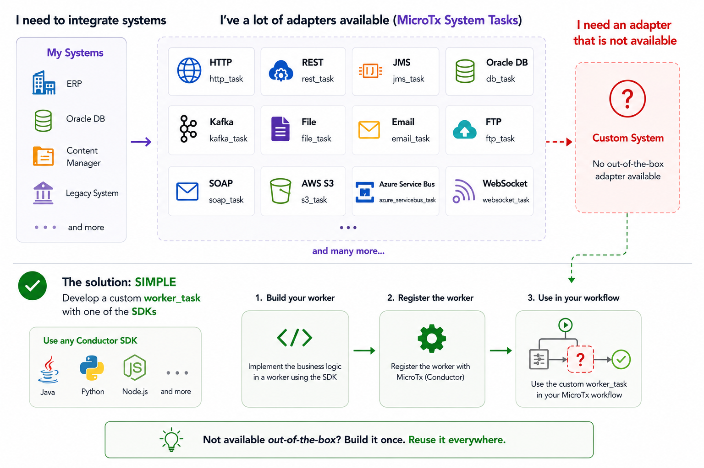
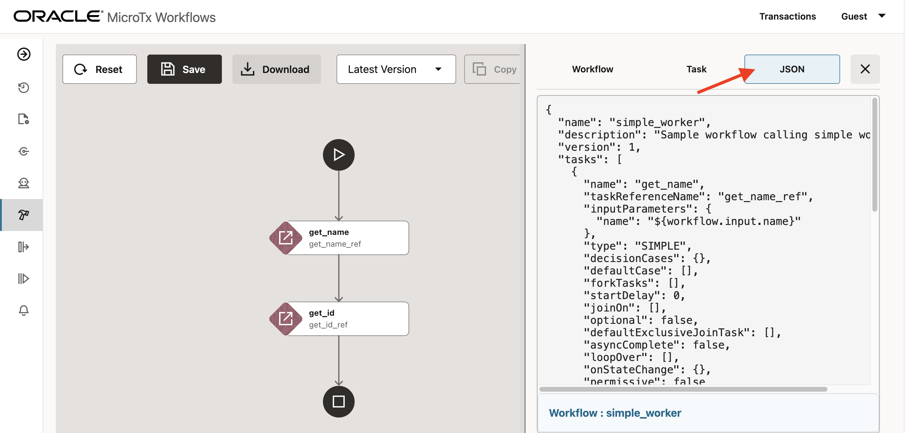
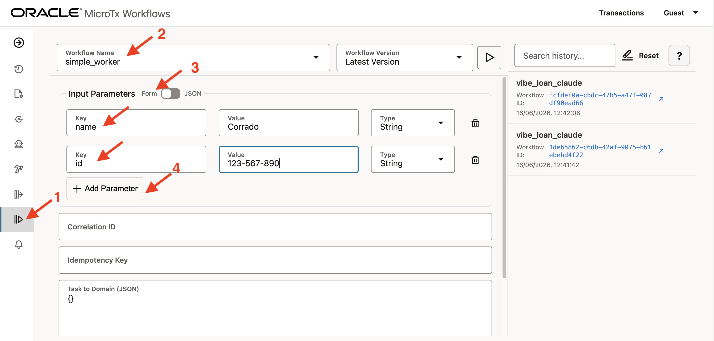
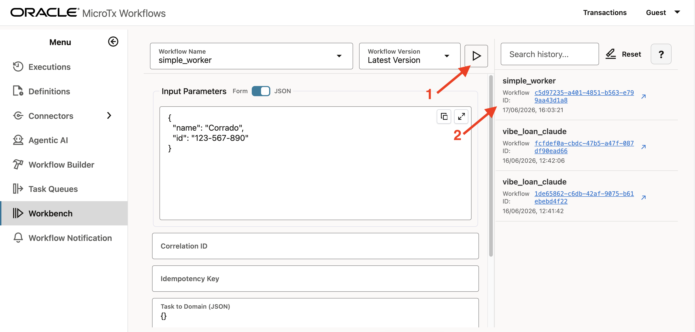
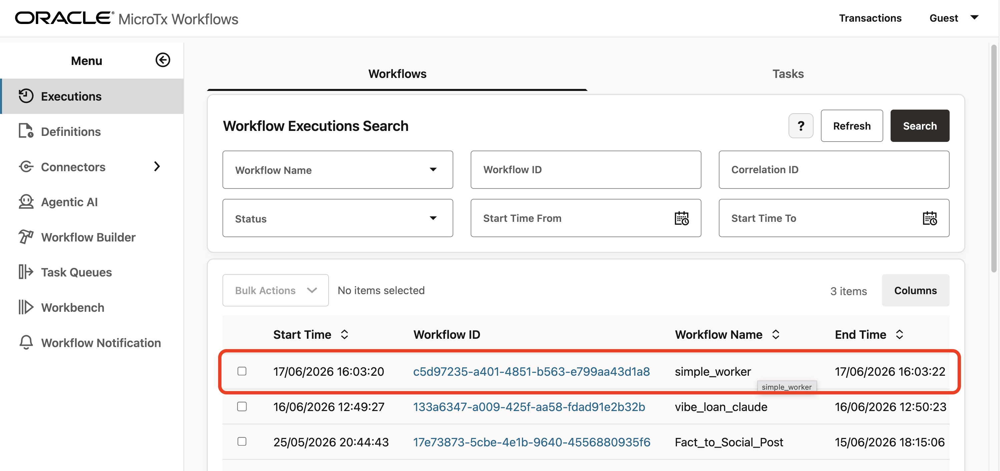
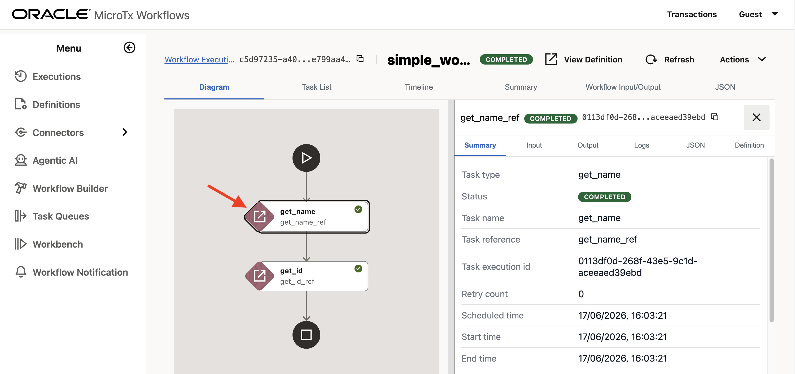
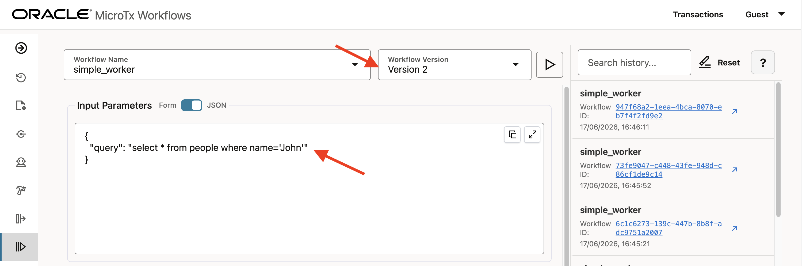
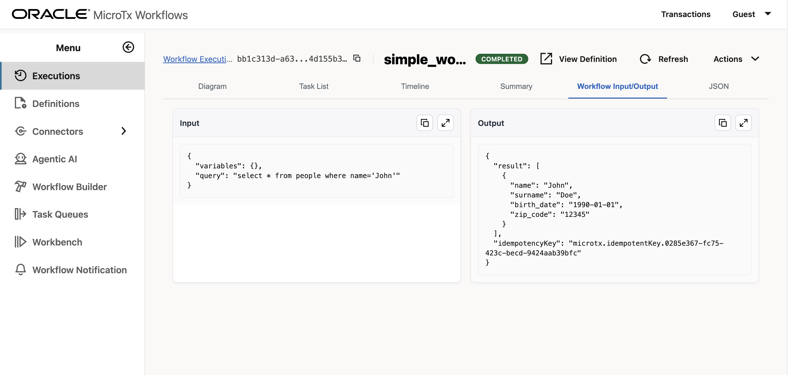

# MicroTx Workflows: Simple Custom Workers
<p align="center">
  <a href="https://github.com/corradodebari/skills">
    
  </a>
  <a href="https://www.oracle.com/database/">
    
  </a>
  <a href="https://www.oracle.com/it/database/transaction-manager-for-microservices/">
    
  </a>
  <a href="https://corradodebari.github.io">
    
  </a>
</p>


<p align="center">
  
</p>

In this tutorial, I'll show how to adapt the basic Python worker example from the [Python SDK](https://github.com/conductor-oss/python-sdk) to the MicroTx Workflow platform and create a worker process for a `SIMPLE` task type defined in the workflow.
A second example shows how to integrate an external database resource, SQLite in this case; you can adapt it for databases other than the Oracle Database or PostgreSQL connectors currently supported in MicroTx.


## Set up the platform
For a quick, free development installation:
- From [Oracle Container Registry](https://container-registry.oracle.com/), download and install an `Oracle AI Database 26ai Free Container` using Docker or Podman.
- Download `Oracle Transaction Manager for Microservices Free` from [here](https://www.oracle.com/database/technologies/transaction-manager-for-microservices-downloads.html).
- Follow the instructions [here](https://github.com/oracle-samples/microtx-samples/tree/main/docs/quickstart) to run the MicroTx platform locally on your laptop.
- Check the installation in a browser by opening the console at: `http://127.0.0.1/consoleui/`.

## Set up the environment
- Prepare the Python environment:

```shell

python3 -m venv .venv
source .venv/bin/activate
python -m ensurepip --upgrade
python -m pip install --upgrade pip
python -m pip install conductor-python
```

- Set the standard endpoint for engine communication, which is slightly different from the standard Conductor URL:

```shell
CONDUCTOR_SERVER_URL=http://127.0.0.1/workflow-server/api
```
## Install the example workflow

- Create a new workflow from `simple_worker.json`:
```json

{
  "name": "simple_worker",
  "description": "Sample workflow calling simple workers",
  "version": 1,
  "tasks": [
    {
      "name": "get_name",
      "taskReferenceName": "get_name_ref",
      "inputParameters": {
        "name": "${workflow.input.name}"
      },
      "type": "SIMPLE",
      "decisionCases": {},
      "defaultCase": [],
      "forkTasks": [],
      "startDelay": 0,
      "joinOn": [],
      "optional": false,
      "defaultExclusiveJoinTask": [],
      "asyncComplete": false,
      "loopOver": [],
      "onStateChange": {},
      "permissive": false
    },
    {
      "name": "get_id",
      "taskReferenceName": "get_id_ref",
      "inputParameters": {
        "id": "${workflow.input.name}"
      },
      "type": "SIMPLE",
      "decisionCases": {},
      "defaultCase": [],
      "forkTasks": [],
      "startDelay": 0,
      "joinOn": [],
      "optional": false,
      "defaultExclusiveJoinTask": [],
      "asyncComplete": false,
      "loopOver": [],
      "onStateChange": {},
      "permissive": false
    }
  ],
  "inputParameters": [],
  "outputParameters": {},
  "schemaVersion": 2,
  "restartable": true,
  "workflowStatusListenerEnabled": false,
  "timeoutPolicy": "TIME_OUT_WF",
  "timeoutSeconds": 60,
  "variables": {},
  "inputTemplate": {},
  "enforceSchema": true,
  "metadata": {}
}
```

- In the MicroTx console, import the JSON file content as a new process from the `Workflow Builder` menu:

<p align="center">
  
</p>

## Develop the workers

- The actual workers are in `workers_collection.py`: **get_name** and **get_id**, which are defined in the workflow as `SIMPLE` task types:

```python
from conductor.client.worker.worker_task import worker_task


@worker_task(task_definition_name='get_name')
def get_name(name: str) -> str:
    return f'Hello {name}'

@worker_task(task_definition_name='get_id')
def get_id(id: str) -> str:
    return f'id: {id}'

```

- The worker wrapper, `helloworld.py`:

```python
from conductor.client.automator.task_handler import TaskHandler
from conductor.client.configuration.configuration import Configuration
from conductor.client.workflow.executor.workflow_executor import WorkflowExecutor

# Import the defined simple workers
from workers_collection import get_name, get_id


def main():
    # The workers connect to this MicroTx Workflows endpoint: http://<localhost>/workflow-server/api
    api_config = Configuration()

    workflow_executor = WorkflowExecutor(configuration=api_config)

    # Start polling
    task_handler = TaskHandler(configuration=api_config)
    task_handler.start_processes()


if __name__ == '__main__':
    main()
```

### Execution

- To start the worker, activate the environment and set the endpoint:
```sh
source .venv/bin/activate
export CONDUCTOR_SERVER_URL=http://127.0.0.1/workflow-server/api
python helloworld.py
```

If it works, you should see:

```sh
[oracle@microtx-workflowengine:~/custom_client]$ python helloworld.py
2026-02-12 14:35:26,548 [2409475] conductor.client.automator.task_handler INFO     TaskHandler initialized
2026-02-12 14:35:26,548 [2409475] conductor.client.automator.task_handler INFO     Starting worker processes...
task runner process Process-2 started
2026-02-12 14:35:26,551 [2409475] conductor.client.automator.task_runner INFO     Conductor Worker[name=get_name, pid=2409477, status=active, poll_interval=100ms, thread_count=1, poll_timeout=100ms, lease_extend=false, register_task_def=false]
task runner process Process-3 started
2026-02-12 14:35:26,555 [2409475] conductor.client.automator.task_handler INFO     Started 2 TaskRunner process(es)
2026-02-12 14:35:26,556 [2409475] conductor.client.automator.task_runner INFO     Conductor Worker[name=get_id, pid=2409478, status=active, poll_interval=100ms, thread_count=1, poll_timeout=100ms, lease_extend=false, register_task_def=false]
2026-02-12 14:35:26,556 [2409475] conductor.client.automator.task_handler INFO     Started all processes
```

- To start the workflow, go to **Workbench**, look for **Workflow name**: `simple_worker`, and set the inputs:

<p align="center">
  
</p>

- Start the process:

<p align="center">
  
</p>

- Review the logs from the `Executions` menu:

<p align="center">
  
</p>

- Click to see the details of each executed task and the overall input/output:

<p align="center">
  
</p>

## SQL adapter example
Let's build a more interesting worker that can integrate a database resource other than Oracle or PostgreSQL.

- Create a new workflow from `simple_worker_2.json`:

```json
{
  "name": "simple_worker",
  "description": "Sample workflow calling simple workers",
  "version": 2,
  "tasks": [
    {
      "name": "query_sqlite",
      "taskReferenceName": "query_sqlite_ref",
      "inputParameters": {
        "connection_string": "fake_people.db",
        "query": "${workflow.input.query}"
      },
      "type": "SIMPLE",
      "decisionCases": {},
      "defaultCase": [],
      "forkTasks": [],
      "startDelay": 0,
      "joinOn": [],
      "optional": false,
      "defaultExclusiveJoinTask": [],
      "asyncComplete": false,
      "loopOver": [],
      "onStateChange": {},
      "permissive": false
    }
  ],
  "inputParameters": [],
  "outputParameters": {},
  "schemaVersion": 2,
  "restartable": true,
  "workflowStatusListenerEnabled": false,
  "timeoutPolicy": "TIME_OUT_WF",
  "timeoutSeconds": 60,
  "variables": {},
  "inputTemplate": {},
  "enforceSchema": true,
  "metadata": {}
}
```
- In the MicroTx console, import the JSON file content as a new process from the `Workflow Builder` menu. Once saved, both versions of **simple_worker** will be available, because the JSON file sets:

```json
"version": 2,
```

### Develop the worker

- The actual worker, `sqlite_query.py`, has:
  - The **execute_sqlite_query()** function, with two parameters: **connection_string** and **query**
  - The **create_fake_database()** function, which creates an example database:

```python
import sqlite3
import logging
import os
from conductor.client.worker.worker_task import worker_task

logging.basicConfig(level=logging.INFO)
logger = logging.getLogger(__name__)

# Create database and insert fake data
def create_fake_database():
    if os.path.exists('fake_people.db'):
        return  # Database already exists, skip creation

    conn = sqlite3.connect('fake_people.db')
    cursor = conn.cursor()

    # Create table
    cursor.execute('''CREATE TABLE IF NOT EXISTS people (
        name TEXT,
        surname TEXT,
        birth_date TEXT,
        zip_code TEXT
    )''')

    # Insert fake data
    fake_data = [
        ('John', 'Doe', '1990-01-01', '12345'),
        ('Jane', 'Smith', '1985-05-15', '67890'),
        ('Bob', 'Johnson', '1992-03-20', '11111'),
        ('Alice', 'Williams', '1988-12-10', '22222'),
        ('Charlie', 'Brown', '1995-07-04', '33333')
    ]

    cursor.executemany('INSERT INTO people VALUES (?, ?, ?, ?)', fake_data)
    conn.commit()
    conn.close()

@worker_task(task_definition_name='query_sqlite')
def execute_sqlite_query(connection_string:str, query:str):
    """
    Executes a SQLite SELECT query on the specified database and returns the results.

    Args:
        connection_string (str): The SQLite database file path or connection string.
        query (str): The SQL SELECT query to execute.

    Returns:
        list[dict]: Query results as native Python data for JSON serialization by MicroTx.
    """
    try:
        db_path = os.path.join(os.getcwd(), connection_string)
        logger.info("SQLite connection_string received: %r", connection_string)
        logger.info("SQLite current working directory: %s", os.getcwd())
        logger.info("SQLite resolved database path: %s", db_path)
        conn = sqlite3.connect(db_path)
        cursor = conn.cursor()


        logger.info("Executing SQLite query: %s", query)
        cursor.execute(query)
        results = cursor.fetchall()

        columns = [desc[0] for desc in cursor.description]

        data = [dict(zip(columns, row)) for row in results]

        conn.close()

        return data
    except Exception as e:
        return {"error": str(e)}
```

- The worker wrapper, `sqlite_tool.py`, creates the database at startup and exposes the worker:

```python
from conductor.client.automator.task_handler import TaskHandler
from conductor.client.configuration.configuration import Configuration
from conductor.client.workflow.executor.workflow_executor import WorkflowExecutor

from sqlite_query import create_fake_database, execute_sqlite_query


def main():
    # The workers connect to this MicroTx Workflows endpoint: http://<localhost>/workflow-server/api
    api_config = Configuration()

    workflow_executor = WorkflowExecutor(configuration=api_config)

    # Start polling
    task_handler = TaskHandler(configuration=api_config)
    task_handler.start_processes()


if __name__ == '__main__':
    create_fake_database()
    main()
```

### Execution
- To start the worker, as usual:
```sh
source .venv/bin/activate
export CONDUCTOR_SERVER_URL=http://127.0.0.1/workflow-server/api
python sqlite_tool.py
```

- In the `Workbench`, select **simple_worker**, choose version **2**, and run it, setting an input variable:
 ```"query":"select * from people where name='John'"```

<p align="center">
  
</p>


- You should see the expected output:

<p align="center">
  
</p>

### Additional checks
- If you want to check if any tasks are in the queue:

```sh
curl -X GET http://127.0.0.1/workflow-server/api/tasks/poll/batch/get_name
```
- If you want to browse the REST API list in a browser:
```sh
http://127.0.0.1/workflow-server/swagger-ui/index.html#/metadata-resource/getAll
```


## Disclaimer
*The views expressed in this paper are my own and do not necessarily reflect the views of Oracle.*
