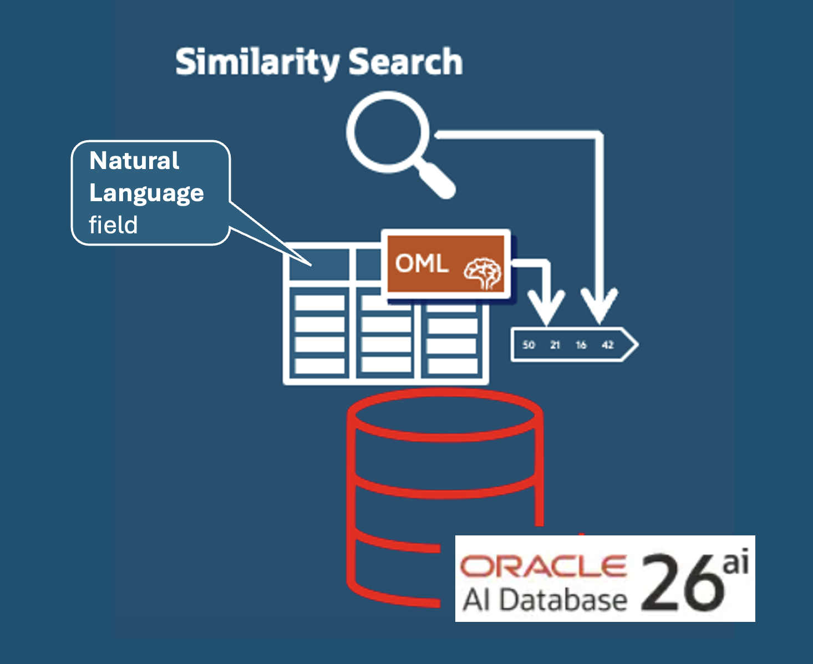
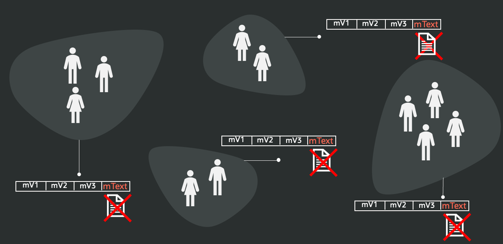
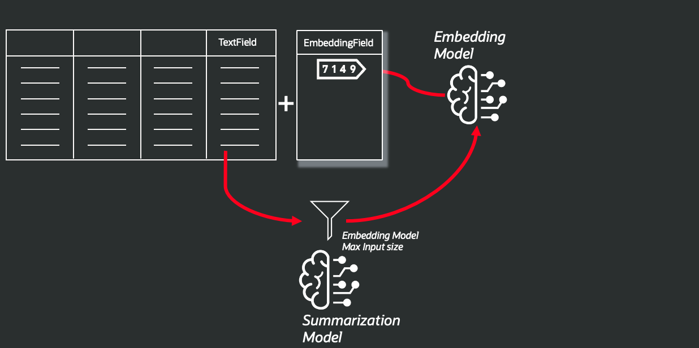
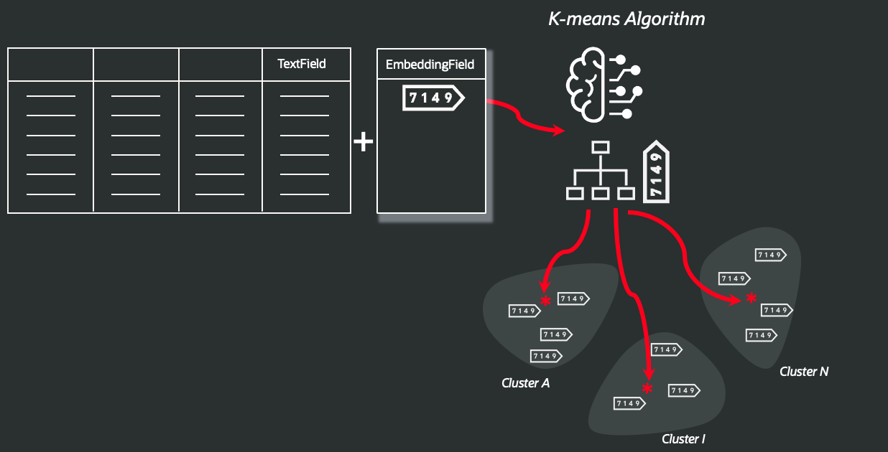
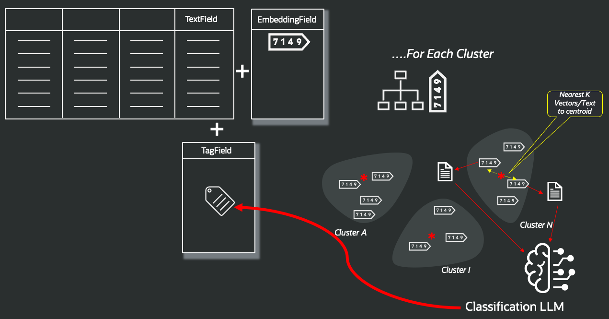

# Similarity Search on Tabular Data with Natural Language Fields

<p align="center">
  
</p>

With the introduction of the vector data type and the algorithms available in Oracle Machine Learning (OML) starting from Oracle Database 23ai [[2](https://docs.oracle.com/en/database/oracle/oracle-database/26/vecse/vectorize-relational-tables-using-oml-feature-extraction-algorithms.html)], it is now possible to vectorize records—e.g., via PCA—to support both clustering and similarity search. However, these algorithms do not natively handle fields that contain natural language effectively. This limitation is common in real-world scenarios such as CRM systems, where free-text operator notes or customer feedback coexist with structured attributes like customer profiles and product details.

In this article, we present a technique that seamlessly combines numerical, categorical, and natural language fields into a **single, unified vector representation** of the entire record. The objective is to improve similarity search and clustering accuracy by preserving both the numerical structure of the data and the semantic meaning of its textual content—without relying on rigid, static WHERE filters that can unnecessarily restrict the results returned.

<br>
<center><strong>Authors</strong></center>
<table style="border: none; border-collapse: collapse; width: 100%; text-align: center;">
  <tr>
    <td style="border: none; padding: 8px;"><strong>Lidia Corbo</strong></td>
    <td style="border: none; padding: 8px;"><strong>Corrado De Bari</strong></td>
  </tr>
  <tr>
    <td style="border: none; padding: 8px;">lidia.corbo@oracle.com</td>
    <td style="border: none; padding: 8px;">corrado.de.bari@oracle.com</td>
  </tr>
</table>

<br>
<br>


## Introduction
Let us assume we have data stored in relational form and we want to group records using k-means or perform similarity searches. A common approach is to transform each row into a numerical vector using OML Feature Extraction, which projects the data into a lower-dimensional space. For instance, Singular Value Decomposition (SVD) can be used to obtain a Principal Component Analysis (PCA)-like projection of the original table. Thanks to Oracle Machine Learning (OML) [[1](https://github.com/corradodebari/vectorsearch/)], [[2](https://docs.oracle.com/en/database/oracle/oracle-database/26/vecse/vectorize-relational-tables-using-oml-feature-extraction-algorithms.html)], this entire workflow can be executed directly inside the Oracle Database, without exporting data to external systems.

When combining vector search with traditional filters—e.g., applying WHERE conditions and then ranking results with ORDER BY VECTOR_DISTANCE()—the similarity computation is performed only on the filtered subset. This can unintentionally narrow the search space and introduce bias, because potentially relevant candidates are excluded before the vector distance is evaluated.

A further challenge arises when records include fields such as free text, addresses, or other attributes with semantic content. In these cases, a purely numerical projection is insufficient: the semantic meaning of the text must be represented as well, so that the entire record can be accurately embedded into a multidimensional space and compared consistently during clustering and similarity search.

<p align="center">
  
</p>

In this article, we show how to incorporate one or more natural-language fields into a single, end-to-end vectorization workflow by following these steps:

1. **Embed the text fields** by converting their content into vector embeddings using a Large Language Model (LLM), either hosted inside the database or accessed through an external service. If needed, this step is preceded by a **Summarization** step that adapt the size of text field to the maximum size of token it could be accepted by the embedding model at the next step.

2.	**Cluster the embeddings** with a k-means algorithm to partition the texts into *N* groups, where *N* reflects the number of categories you want for your segmentation.

3.	**For each cluster**:

    3.1 **Compute the centroid** to represent the cluster’s “average” semantic profile.

    3.2 **Select the top-K representative texts**, typically the ones closest to the centroid.

    3.3 **Derive a cluster label** by asking an LLM to classify the representative texts. This can be done either by:

    - choosing from a predefined set of labels (with descriptions)
    - letting the LLM generate a concise label that summarizes the cluster’s theme.

4.	**Enrich the dataset** by adding a new attribute to each record containing the assigned cluster label.

5.	**Re-run feature extraction** on the full table—now including the label field—using an SVD-based approach to obtain a PCA-style projection that blends numerical, categorical, and text-derived information into a unified vector representation.

At the end of this process, we obtain a vector representation that also correctly captures the meaning of the textual fields. This allows us to perform more accurate similarity searches and clustering operations.

In the following source code examples, we refer to a `NEWS_ARTICLES` table in which there is a column `ARTICLE` hosting natural language text.

## Setup
First you need to enable the DB23ai/26ai instance to call external http endpoint on a <USER> input, plus some other grants, running as <ADMIN>:

```sql
-- AS <ADMIN>
BEGIN
  DBMS_NETWORK_ACL_ADMIN.APPEND_HOST_ACE(
    host => '*',
    ace => xs$ace_type(privilege_list => xs$name_list('http'),
                       principal_name => '<USER>',
                       principal_type => xs_acl.ptype_db));
END;
/

GRANT CREATE CREDENTIAL TO <USER>;
GRANT CREATE MINING MODEL to <USER>;
/
```

## Embeddings NL fields
In this paper, we use OCI Generative AI LLMs for text embeddings, summarization, and chat completion. As an alternative for embeddings, you can also run models locally in the database by importing an ONNX model and generating vectors directly in Oracle Database. If you prefer this approach, see the **ONNX Embeddings** section later in this document.

Summarization and chat completion, however, still require an LLM accessed externally (e.g., via OCI Generative AI), as these capabilities are not provided by local ONNX embeddings models alone.

### OCI GenAI models:
Before to show the full codes, let us point out in the following an example on how to call an LLM model on OCI GenAI from your DB user account. Fill with your own personal data the `jo.put(..)` values:
```sql
-- AS <USER>
declare
  jo json_object_t;
begin
  -- create an OCI credential
  jo := json_object_t();
  jo.put('user_ocid', 'ocid1.user.oc1..aaaaaaa...');
  jo.put('tenancy_ocid', 'ocid1.tenancy.oc1..aa...');
  jo.put('compartment_ocid', 'ocid1.compartment.oc1..');
  jo.put('private_key', 'MIIEvAIBADANBgkqhkiG9w0BAQEFAAS...........');
  jo.put('fingerprint', 'bf:90:1a:67:ed:da:ca:24....');
  dbms_output.put_line(jo.to_string);
  dbms_vector_chain.create_credential(
    credential_name => 'OCI_GENERATIVE_AI_CRED',
    params => json(jo.to_string));
end; 
/
```
If you want to verify that your credential have been correctly set, let's test in this way:

```sql
select dbms_vector_chain.utl_to_embedding('hello', 
    JSON('{
            "provider": "ocigenai",
            "credential_name" : "OCI_GENERATIVE_AI_CRED", 
            "url": "https://inference.generativeai.us-chicago-1.oci.oraclecloud.com/20231130/actions/embedText",
            "model": "cohere.embed-multilingual-v3.0"}')
    ) from dual;
```

The workflow begins with an optional summarization step that reduces the original text to fit within the embedding model’s maximum input length — around 256 tokens for `cohere.embed-multilingual-v3.0` — while preserving the key semantics that will be captured in the resulting embedding vectors. If your text is already below this limit, you can skip summarization and avoid the cost of this additional step.

<p align="center">
  
</p>

This is an example of function that implements this step:

```sql
CREATE OR REPLACE FUNCTION add_summary_and_embeddings(
    p_table_name         IN VARCHAR2,     -- Table name
    p_text_col           IN VARCHAR2,     -- Text field name
    p_max_tokens         IN PLS_INTEGER,  -- Max token input size
    p_summary_col        IN VARCHAR2,     -- Field name for the summarization output
    p_embedding_col      IN VARCHAR2,     -- Field name for the embedding vector based summarization output
    p_summary_model      IN VARCHAR2,     -- LLM model for summarization 
    p_embedding_model    IN VARCHAR2,     -- LLM model for embedding
    p_credential_name    IN VARCHAR2      -- credential identifier   
) RETURN PLS_INTEGER
IS
    l_table        VARCHAR2(4000) := DBMS_ASSERT.qualified_sql_name(p_table_name);
    l_text_col     VARCHAR2(4000) := DBMS_ASSERT.simple_sql_name(p_text_col);
    l_summary_col  VARCHAR2(4000) := DBMS_ASSERT.simple_sql_name(p_summary_col);
    l_embed_col    VARCHAR2(4000) := DBMS_ASSERT.simple_sql_name(p_embedding_col);

    v_provider_params  CLOB;
    v_sum_params       CLOB;

    v_text         CLOB;
    v_sum          CLOB;

    v_embeddings   VECTOR_ARRAY_T;
    v_vec          VECTOR;

    v_rows         PLS_INTEGER := 0;

    TYPE t_rc IS REF CURSOR;
    rc    t_rc;
    v_rid ROWID;

    -- minimal JSON string escape (quotes + backslashes)
    FUNCTION esc_json(p IN VARCHAR2) RETURN VARCHAR2 IS
    BEGIN
      RETURN REPLACE(REPLACE(p, '\', '\\'), '"', '\"');
    END;
BEGIN
    -- Embedding params JSON (model + credential parameterized)
    v_provider_params :=
      '{' ||
      '"provider":"OCIGenAI",' ||
      '"credential_name":"' || esc_json(p_credential_name) || '",' ||
      '"url":"https://inference.generativeai.eu-frankfurt-1.oci.oraclecloud.com/20231130/actions/embedText",' ||
      '"model":"' || esc_json(p_embedding_model) || '",' ||
      '"batch_size":"96"' ||
      '}';

    -- Summary params JSON (model + credential + maxTokens parameterized)
    v_sum_params :=
      '{' ||
      '"provider":"ocigenai",' ||
      '"credential_name":"' || esc_json(p_credential_name) || '",' ||
      '"url":"https://inference.generativeai.eu-frankfurt-1.oci.oraclecloud.com/20231130/actions/chat",' ||
      '"model":"' || esc_json(p_summary_model) || '",' ||
      '"temperature":"0.0",' ||
      '"length":"SHORT",' ||
      '"format":"PARAGRAPH",' ||
      '"chatRequest":{"maxTokens":' || TO_CHAR(p_max_tokens) || '}' ||
      '}';

    OPEN rc FOR
        'SELECT ROWID, ' || l_text_col || ' FROM ' || l_table;

    LOOP
        FETCH rc INTO v_rid, v_text;
        EXIT WHEN rc%NOTFOUND;

        v_sum := DBMS_VECTOR_CHAIN.utl_to_summary(v_text, JSON(v_sum_params));

        v_embeddings := DBMS_VECTOR.UTL_TO_EMBEDDINGS(v_sum, JSON(v_provider_params));
        v_vec := TO_VECTOR(JSON_VALUE(v_embeddings(1), '$.embed_vector' RETURNING CLOB));

        EXECUTE IMMEDIATE
            'UPDATE ' || l_table || '
             SET ' || l_summary_col || ' = :1,
                 ' || l_embed_col   || ' = :2
             WHERE ROWID = :3'
        USING v_sum, v_vec, v_rid;

        v_rows := v_rows + 1;
    END LOOP;

    CLOSE rc;
    COMMIT;
    RETURN v_rows;
END;
/
```

This is an example of call:

```sql
BEGIN
  DBMS_OUTPUT.put_line(
    add_summary_and_embeddings(
      p_table_name      => 'NEWS_ARTICLES',
      p_text_col        => 'ARTICLE',
      p_max_tokens      => 256,
      p_summary_col     => 'SUMMARY_ART',
      p_embedding_col   => 'ARTICLE_EMBEDDING',
      p_summary_model   => 'meta.llama-3.3-70b-instruct',
      p_embedding_model => 'cohere.embed-multilingual-v3.0',
      p_credential_name => 'OCI_GENERATIVE_AI_CRED'
    )
  );
END;
/
```

At the end of this process we will have a new field called `ARTICLE_EMBEDDING` with the embedding vector representation the summarization of the original `ARTICLE` field stored in `SUMMARY_ART`.

### Option ONNX Embeddings
First, you have to physically import the model in order to be used in the `DBMS_VECTOR.UTL_TO_EMBEDDINGS()` function. Take in consideration that if you reduce to the maximum summary token number the size of ONNX model, you could use in any case a in-DB running model for embeddings.

1. Download the embedding model in ONNX

    For example, we download and going to use the model: **all_MiniLM_L12_v2.onnx**, you can find [here](https://adwc4pm.objectstorage.us-ashburn-1.oci.customer-oci.com/p/TtH6hL2y25EypZ0-rrczRZ1aXp7v1ONbRBfCiT-BDBN8WLKQ3lgyW6RxCfIFLdA6/n/adwc4pm/b/OML-ai-models/o/all_MiniLM_L12_v2_augmented.zip).

2. Give permissions to your user to use the embedding model in ONNX

    If you have a local podman DB23ai instance running:

    ```bash
    podman cp ./all-MiniLM-L12-v2.onnx <DB_name>:/home/oracle/

    docker exec -it <DB_name> sqlplus / as sysdba
    ```
    Execute following command in sqlplus shell to allow your <USER> in your pdb instance <PDB_NAME> to import and use the model:

    ```sql
    alter session set container=<PDB_NAME>;
    grant db_developer_role, create mining model to vector;
    create or replace directory dm_dump as '/home/oracle';
 
    grant read on directory dm_dump to <USER>;
    grant write on directory dm_dump to <USER>;
    ```

3. Import the model

    Then, as a `<USER>`, login
    ```bash
    sqlplus <USER>/<PASSWORD>@//localhost:1521/<PDB_NAME>
    ```

    and execute:

    ```sql
    BEGIN
      DBMS_VECTOR.DROP_ONNX_MODEL(
        model_name => 'ALL_MINILM_L12_V2',
        force      => TRUE
      );
    END;
    /

    BEGIN
    DBMS_VECTOR.LOAD_ONNX_MODEL(
	    directory => 'DM_DUMP',
               file_name => 'all_MiniLM_L12_v2.onnx',
               model_name => 'ALL_MINILM_L12_V2',
               metadata => JSON('{"function":"embedding","embeddingOutput":"embedding", "input":{"input": ["DATA"]}}'));
    END;
    /
    ```

4. Change, in the source code in the `add_summary_and_embeddings()` function, the value of `v_provider_params`:

    ```sql
      v_provider_params :=
        '{' ||
        '"model":"' || esc_json(p_embedding_model) || '"' ||
        '}';
    ```
    So, a call example will be:
    
    ```sql
    BEGIN
      DBMS_OUTPUT.put_line(
        add_summary_and_embeddings(
          p_table_name      => 'NEWS_ARTICLES',
          p_text_col        => 'ARTICLE',
          p_max_tokens      => 256,
          p_summary_col     => 'SUMMARY_ART',
          p_embedding_col   => 'ARTICLE_EMBEDDING',
          p_summary_model   => 'meta.llama-3.3-70b-instruct',
          p_embedding_model => 'ALL_MINILM_L12_V2',
          p_credential_name => 'OCI_GENERATIVE_AI_CRED'
        )
      );
    END;
    /
    ```

## K-means on vector embeddings
We now apply a k-means algorithm to the embedding vectors we generated in order to segment the entire population into *N* clusters, as illustrated in the following diagram:

<p align="center">
  
</p>

This a function ready to be applied on your own data:

```sql
CREATE OR REPLACE FUNCTION create_kmeans_emb_model (
    p_n_clusters      IN PLS_INTEGER,               -- Number of cluster needed
    p_record_id_col   IN VARCHAR2,                  -- Field identify the Primary Key
    p_embedding_col   IN VARCHAR2,                  -- Field with the vector embeddings 
    p_table_name      IN VARCHAR2,                  -- Original Table holding the text fields
    p_model_name      IN VARCHAR2 DEFAULT 'KM_EMB', -- The name of k-means will be created
    p_drop_if_exists  IN BOOLEAN  DEFAULT TRUE      -- remove a k-means model if already exists
) RETURN VARCHAR2
IS
    v_setlst     DBMS_DATA_MINING.SETTING_LIST;
    v_data_query VARCHAR2(32767);

    v_table_name    VARCHAR2(4000);
    v_id_col        VARCHAR2(4000);
    v_emb_col       VARCHAR2(4000);
BEGIN
    IF p_n_clusters IS NULL OR p_n_clusters < 1 THEN
        RAISE_APPLICATION_ERROR(-20001, 'p_n_clusters must be >= 1');
    END IF;

    -- Basic hardening against SQL injection for identifiers
    v_table_name := DBMS_ASSERT.SQL_OBJECT_NAME(p_table_name);
    v_id_col     := DBMS_ASSERT.SIMPLE_SQL_NAME(p_record_id_col);
    v_emb_col    := DBMS_ASSERT.SIMPLE_SQL_NAME(p_embedding_col);

    v_setlst('ALGO_NAME')         := 'ALGO_KMEANS';
    v_setlst('KMNS_DISTANCE')     := 'KMNS_COSINE';
    v_setlst('KMNS_DETAILS')      := 'KMNS_DETAILS_ALL';
    v_setlst('CLUS_NUM_CLUSTERS') := TO_CHAR(p_n_clusters);

    v_data_query := 'SELECT ' || v_id_col || ', ' || v_emb_col || ' FROM ' || v_table_name;

    IF p_drop_if_exists THEN
        BEGIN
            DBMS_DATA_MINING.DROP_MODEL(p_model_name);
        EXCEPTION
            WHEN OTHERS THEN
                NULL; -- ignore if it doesn't exist
        END;
    END IF;

    DBMS_DATA_MINING.CREATE_MODEL2(
        MODEL_NAME          => p_model_name,
        MINING_FUNCTION     => 'CLUSTERING',
        DATA_QUERY          => v_data_query,
        SET_LIST            => v_setlst,
        CASE_ID_COLUMN_NAME => v_id_col
    );

    RETURN p_model_name;
END;
/
```

and a call example it could be:

```sql
DECLARE
  v_model_name VARCHAR2(30);
BEGIN
  v_model_name := create_kmeans_emb_model(
                    p_n_clusters    => 3,
                    p_record_id_col => 'ID',
                    p_embedding_col => 'ARTICLE_EMBEDDING',
                    p_table_name    => 'NEWS_ARTICLES',
                    p_model_name    => 'KM_EMB'
                  );
  DBMS_OUTPUT.PUT_LINE('Created model: ' || v_model_name);
END;
/
```

## Get nearest K contents to each centroids

With the following code, we retrieve the *K* text chunks closest to each cluster centroid, producing a compact set of representative samples for every cluster. Centroids are computed by applying `AVG()` to the embedding vectors.

This sampling step dramatically reduces the amount of text that must be sent to the LLM in the next phase for classification, helping you stay within the selected model’s context-window limits. You can increase the sample size *K*—especially when working with many clusters—as long as the total input still fits within the context window, which can improve labeling accuracy.

`context_size` refers to the dimensionality of the embedding vectors produced by the model, and similarity is computed using **cosine distance**.

The resulting samples are written to a new table whose name is provided as an input to the function.


```sql
CREATE OR REPLACE FUNCTION build_topk_view_sql (
    top_k_rows_table    IN VARCHAR2,                  --  The View will be created with the nearest K vectors to the centroids
    v_id_col            IN VARCHAR2,                  --  Field identify the Primary Key
    p_text_col          IN VARCHAR2,                  --  Field name storing the Summarized Text or Original one
    p_embedding_col     IN VARCHAR2,                  --  Vector Embeddings
    vector_size         IN PLS_INTEGER,               --  Vector size
    k                   IN PLS_INTEGER,               --  K nearest texts 
    p_source_table      IN VARCHAR2,                  --  Original Table holding the text fields
    p_model_name        IN VARCHAR2 DEFAULT 'KM_EMB'  -- The name of k-means will be created
) RETURN CLOB
IS
    v_view_name   VARCHAR2(4000);
    v_table_name  VARCHAR2(4000);
    v_id          VARCHAR2(4000);
    v_txt         VARCHAR2(4000);
    v_emb         VARCHAR2(4000);
    v_sql         CLOB;
BEGIN
    IF vector_size IS NULL OR vector_size < 1 THEN
        RAISE_APPLICATION_ERROR(-20001, 'vector_size must be >= 1');
    END IF;

    IF k IS NULL OR k < 1 THEN
        RAISE_APPLICATION_ERROR(-20002, 'k must be >= 1');
    END IF;

    -- Harden identifiers
    v_view_name  := DBMS_ASSERT.SIMPLE_SQL_NAME(top_k_rows_table);
    v_table_name := DBMS_ASSERT.SQL_OBJECT_NAME(p_source_table);
    v_id         := DBMS_ASSERT.SIMPLE_SQL_NAME(v_id_col);
    v_txt        := DBMS_ASSERT.SIMPLE_SQL_NAME(p_text_col);
    v_emb        := DBMS_ASSERT.SIMPLE_SQL_NAME(p_embedding_col);

    v_sql :=
        'CREATE OR REPLACE VIEW ' || v_view_name || ' AS ' || CHR(10) ||
        'WITH clustered_data AS (' || CHR(10) ||
        '  SELECT' || CHR(10) ||
        '    ' || v_id || ' AS cust_id,' || CHR(10) ||
        '    ' || v_txt || ' AS des,' || CHR(10) ||
        '    CLUSTER_ID(' || p_model_name || ' USING ' || v_emb || ') AS clus,' || CHR(10) ||
        '    TO_VECTOR(' || v_emb || ', ' || TO_CHAR(vector_size) || ', FLOAT64) AS desc_embedding' || CHR(10) ||
        '  FROM ' || v_table_name || CHR(10) ||
        '),' || CHR(10) ||
        'centroids AS (' || CHR(10) ||
        '  SELECT' || CHR(10) ||
        '    clus,' || CHR(10) ||
        '    AVG(desc_embedding) AS cluster_centroid' || CHR(10) ||
        '  FROM clustered_data' || CHR(10) ||
        '  GROUP BY clus' || CHR(10) ||
        '),' || CHR(10) ||
        'distances AS (' || CHR(10) ||
        '  SELECT' || CHR(10) ||
        '    d.cust_id,' || CHR(10) ||
        '    d.des,' || CHR(10) ||
        '    d.desc_embedding,' || CHR(10) ||
        '    d.clus,' || CHR(10) ||
        '    c.cluster_centroid,' || CHR(10) ||
        '    VECTOR_DISTANCE(TO_VECTOR(d.desc_embedding, ' || TO_CHAR(vector_size) || ', FLOAT64), c.cluster_centroid, COSINE) AS dist_from_centroid,' || CHR(10) ||
        '    ROW_NUMBER() OVER (' || CHR(10) ||
        '      PARTITION BY d.clus' || CHR(10) ||
        '      ORDER BY VECTOR_DISTANCE(TO_VECTOR(d.desc_embedding, ' || TO_CHAR(vector_size) || ', FLOAT64), c.cluster_centroid, COSINE)' || CHR(10) ||
        '    ) AS rn' || CHR(10) ||
        '  FROM clustered_data d' || CHR(10) ||
        '  JOIN centroids c ON d.clus = c.clus' || CHR(10) ||
        ')' || CHR(10) ||
        'SELECT cust_id, clus, des, dist_from_centroid' || CHR(10) ||
        'FROM distances' || CHR(10) ||
        'WHERE rn <= ' || TO_CHAR(k) || CHR(10) ||
        'ORDER BY clus, rn';

    RETURN v_sql;
END;
/
```

To actually create the view, this an example:
```sql
DECLARE
  v_sql CLOB;
BEGIN
  v_sql := build_topk_view_sql(
            top_k_rows_table => 'TOPKROW',
            v_id_col         => 'ID',
            p_text_col       => 'SUMMARY_ART',
            p_embedding_col  => 'ARTICLE_EMBEDDING',
            k                => 10,
            vector_size      => 1024,
            p_source_table   => 'NEWS_ARTICLES',
            p_model_name        => 'KM_EMB'
          );

  EXECUTE IMMEDIATE v_sql;
END;
/
```

## Classify contents with an external LLM
Now it's time to transform in a categorical value the original Natural Language fiels, asking to an LLM to apply a classification the subset of each cluster in order to define a topic to each clustes, like in this case, or providing a list of topics asking the llm to associate with each cluster, as shown in this diagram:


<p align="center">
  
</p>

After this final process, the original TextField has been replaced by a tag that represent it's content and that could be used in a PCA algorithm to embed and compare the full record content in a segmentation or similarity search activity.
Let's prepare the table to store the original contents and the related label:

```sql
DROP TABLE news_articles_label CASCADE CONSTRAINTS;

CREATE TABLE news_articles_label AS
SELECT
  a.*,
  t.clus,
  CAST(NULL AS VARCHAR2(100)) AS cluster_label
FROM news_articles a
LEFT JOIN topkrow t
  ON (t.des IS NOT NULL AND a.summary_art IS NOT NULL
      AND DBMS_LOB.COMPARE(t.des, a.summary_art) = 0);
```

Then we can proceed to send each samples collection per cluster asking to the LLM to provide a classification, approaching in two way as mention before:
- ask to represent with a label for each cluster: to be applied if you don't know exactly the content of fields
- according a list of labels provided: if you have in mind what kind of info you are looking for.

This an example of self-classification approach:

```sql
CREATE OR REPLACE FUNCTION label_clusters(
    p_topkrow_table   IN VARCHAR2, --  The View will be created with the nearest K vectors to the centroids
    p_target_table    IN VARCHAR2  --  The final table with the labels 
) RETURN PLS_INTEGER
IS
    l_topkrow   VARCHAR2(4000) := DBMS_ASSERT.qualified_sql_name(p_topkrow_table);
    l_target    VARCHAR2(4000) := DBMS_ASSERT.qualified_sql_name(p_target_table);

    v_cluster_id   NUMBER;  -- will fetch from dynamic SQL
    v_input        CLOB;
    v_output       CLOB;
    v_description  CLOB;

    v_rows         PLS_INTEGER := 0;

    TYPE t_rc IS REF CURSOR;
    rc_clusters t_rc;
    rc_desc     t_rc;

    v_des CLOB;
BEGIN
    -- loop clusters
    OPEN rc_clusters FOR 'SELECT DISTINCT clus FROM ' || l_topkrow;

    LOOP
        FETCH rc_clusters INTO v_cluster_id;
        EXIT WHEN rc_clusters%NOTFOUND;

        DBMS_LOB.createtemporary(v_description, TRUE);

        -- concatenate descriptions for this cluster
        OPEN rc_desc FOR
          'SELECT des FROM ' || l_topkrow || ' WHERE clus = :1'
          USING v_cluster_id;

        LOOP
            FETCH rc_desc INTO v_des;
            EXIT WHEN rc_desc%NOTFOUND;
            DBMS_LOB.append(v_description, v_des || CHR(10));
        END LOOP;
        CLOSE rc_desc;

        v_input :=
          'Based on this list of texts on a similar topic with this index: ' || v_cluster_id || ':' || CHR(10) ||
          'List:' || CHR(10) ||
          v_description || CHR(10) ||
          'Determine the topic that describe better this collection of text. ' ||
          'Return only a text label, with a single word.';

        v_output := dbms_vector_chain.utl_to_generate_text(
          v_input,
          json('{
            "provider":"ocigenai",
            "credential_name":"OCI_GENERATIVE_AI_CRED",
            "url":"https://inference.generativeai.eu-frankfurt-1.oci.oraclecloud.com/20231130/actions/chat",
            "model":"meta.llama-3.3-70b-instruct",
            "chatRequest":{"maxTokens":100,"temperature":0}
          }')
        );

        -- keep only the first "word" as requested
        v_output := REGEXP_SUBSTR(TRIM(v_output), '^\S+');

        DBMS_OUTPUT.PUT_LINE(DBMS_LOB.SUBSTR(v_output, 1000, 1));
        DBMS_OUTPUT.PUT_LINE(TO_CHAR(v_cluster_id));

        -- update target table
        EXECUTE IMMEDIATE
          'UPDATE ' || l_target || ' SET cluster_label = :1 WHERE clus = :2'
          USING v_output, v_cluster_id;

        v_rows := v_rows + SQL%ROWCOUNT;

        DBMS_LOB.freetemporary(v_description);
    END LOOP;

    CLOSE rc_clusters;

    COMMIT;
    RETURN v_rows;
END;
/

```

This could be a call example of call applied on the `news_articles_label` just created:

```sql
BEGIN
  DBMS_OUTPUT.PUT_LINE(
    label_clusters('TOPKROW', 'NEWS_ARTICLES_LABEL')
  );
END;
/
```


## Vectorize the full record content: 

Now, the table `NEWS_ARTICLES_LABEL` is ready to be used in a vectorization process through the PCA reduction for similarity search, that you can follow referring to the example [[1](https://github.com/corradodebari/vectorsearch/)] and [[2](https://docs.oracle.com/en/database/oracle/oracle-database/26/vecse/vectorize-relational-tables-using-oml-feature-extraction-algorithms.html)].

## Closing Remarks

This is just a proposal, through a simple example, to start exploring the Oracle DB 26ai vector store with OML and external LLM to apply similarity search and segmentation to any kind of types combined in an unique search, to preserve the semantic of the all record's field and improve the accuracy across numeric, categorical and text fields.

## References

- [1] ["Unlock Similarity Search on Tabular Data, with the Oracle DB23ai."](https://github.com/corradodebari/vectorsearch/)
- [2] ["Vectorize Relational Tables Using OML Feature Extraction Algorithms"](https://docs.oracle.com/en/database/oracle/oracle-database/26/vecse/vectorize-relational-tables-using-oml-feature-extraction-algorithms.html)


## Disclaimer
*The views expressed in this paper are my own and do not necessarily reflect the views of Oracle.*


