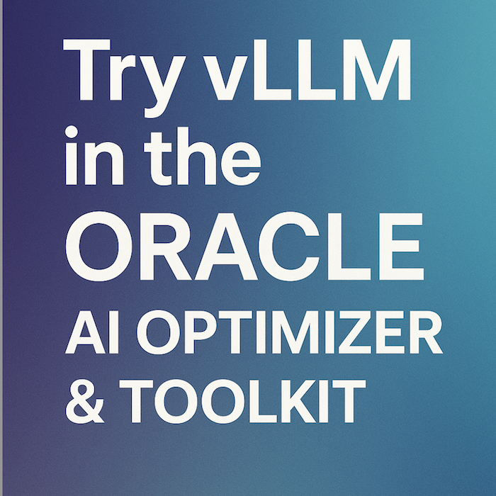

# Try vLLM in the Oracle AI Optimizer & Toolkit 



## Introduction  

I love **Ollama** to test LLMs on my desktop, fully integrated into the [**Oracle AI Optimizer & Toolkit**](https://github.com/oracle/ai-optimizer) to create a **RAG** Agent based on **Oracle DB 23ai**. 
But, if you want to run models on GPU servers through the **[vLLM](https://github.com/vllm-project/vllm)** platform, this is a brief how-to guide to exploit this high scalable, private LLM server provider, just integrated into the AI Optimizer. When you will be satisfied of your experiments, you can export the final configuration and run the RAG Agent as a LangChain MCP server.


## Install vLLM on a GPU server

Having on a server instance, for example a `VM.GPU.A10.1` with an `Oracle Linux 8` - `Gen2-GPU-2025.08.31-0` image from [OCI](https://cloud.oracle.com/), with Docker and GPU support enabled:

1. Register on [Hugging Face](https://huggingface.co/) and create a token [here](https://huggingface.co/settings/tokens)

2. Let's create an LLM chat server, using the <HF_TOKEN> got at the previous step:

```shell
docker run --runtime nvidia --gpus all --name vllm \
    -v ~/.cache/huggingface:/root/.cache/huggingface \
    --env "HUGGING_FACE_HUB_TOKEN=<HF_TOKEN>" \
    -p 8000:8000 \
    --ipc=host \
    vllm/vllm-openai:latest \
    --model meta-llama/Llama-3.2-1B-Instruct
```
3. To test the endpoint:

```shell
curl http://<GPU_SERVER_IP>:8000/v1/chat/completions \
  -H "Content-Type: application/json" \
  -d '{
    "model": "meta-llama/Llama-3.2-1B-Instruct",
    "messages": [
      {"role": "system", "content": "You are a helpful assistant."},
      {"role": "user", "content": "What is the capital of France?"}
    ],
    "temperature": 0.7
  }'
```

4. Now, we create an embedding server, with the token as well:

```shell
docker run --runtime nvidia --gpus all --name vllm-emb \
     -v ~/.cache/huggingface:/root/.cache/huggingface \
     --env "HUGGING_FACE_HUB_TOKEN=<HF_TOKEN>" \
     -p 8001:8000 \
     --ipc=host vllm/vllm-openai:latest \
     --model nomic-ai/nomic-embed-text-v1 --task embedding --trust-remote-code
```

5. Let's test the endpoint:
```shell
curl http://<GPU_SERVER_IP>:8001/v1/embeddings \
  -H "Content-Type: application/json" \
  -d '{
    "model": "nomic-ai/nomic-embed-text-v1",
    "input": ["hello world", "this is an embedding test"]
  }'
```

## Add the LLMs to Oracle AI Optimizer & Toolkit

1. Go to `Configuration`/`Models page`
2. Click `Add` under **Language Models** and set these parameters:

- Model ID: **meta-llama/Llama-3.2-1B-Instruct**
- Provider: **hosted_vllm**
- Provider URL: **http://<GPU_SERVER_IP>:8000/v1**
- Context Length: **131072**
- Max Completion Tokens: **2048**

3. Click `Save`

4. Click `Add` under **Embedding Models** and set these parameters:

- Model ID: **nomic-ai/nomic-embed-text-v1**
- Provider: **hosted_vllm**
- Provider URL: **http://<GPU_SERVER_IP>:8001/v1**
- Max Chunk Size: **8192**

5. Check if model are in the list and `Edit` each one to `Enable`.

## Export as a MCP server.
At the end of your experimentation, you can now export and run the RAG Agent as a **LangChain MCP** server from `Configuration`/`Settings`/`Source Code Templates` : `Download LangchainMCP`. Into the README.md the instructions to run it.

Enjoy all Hugging Face models via this powerful LLM server provider!


---

## Disclaimer
*The views expressed in this paper are my own and do not necessarily reflect the views of Oracle.*


